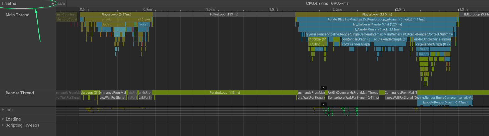
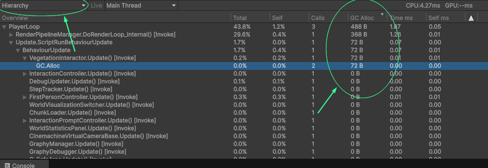
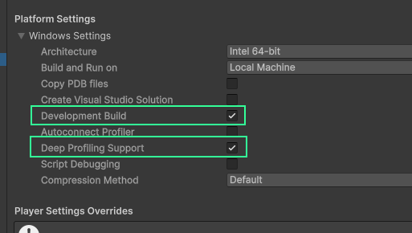
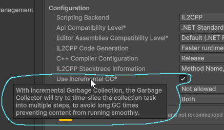
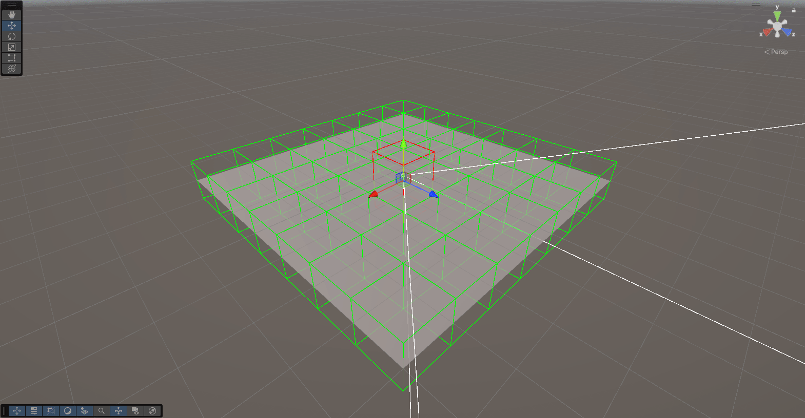
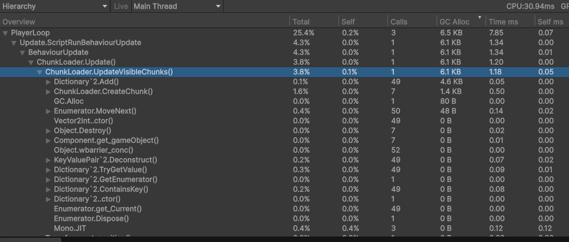
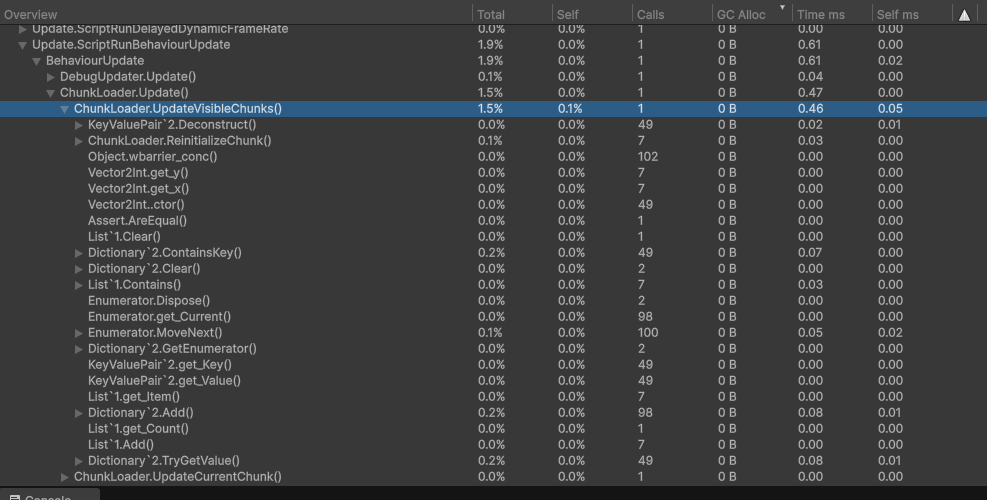

# Masterclass: Data-oriented memory-optimalisaties voor een procedurele terreingenerator

### Casper van Battum • Graduation HKU Game Development

Voor betere weergave van code-blokken en (gif) afbeeldingen, bezoek de GitHub-repo: https://github.com/Creator13/roots-optim/blob/master/1-intro.md

---

Voor mijn afstudeerproject – Roots – heb ik een procedurele terrein-generator geschreven. Een uitdaging die ik hiervoor opgezocht heb was het optimaliseren van de generator: terrein moest tijdens het spelen van de game zonder haperingen geladen worden. 

Unity maakt het makkelijk om snel games te maken, maar daar staat tegenover dat je zelf wat extra werk moet doen om ook _snelle_ games te maken. Met een beetje kennis van hoe programmeertalen en de computer werken valt er een hoop winst te behalen. Het doel van deze masterclass is om een goed begin te leggen voor die kennis.

Door alle optimalisaties heen stond er een ding centraal: hoe ga je om met het geheugen? Feit is dat hier veel winst te behalen valt op moderne hardware. Daarom gaan we voornamelijk kijken naar hoe goed (of slecht) geheugengebruik mij heeft geholpen om een oppervlakte van 24km² verdeeld over 15 chunks in slechts 2ms te genereren. En was dat proces het ook daadwerkelijk waard?

## Wat ga je leren?
Je gaat in deze masterclass leren hoe het bijhouden en bewaren van data de performance van je game beïnvloedt. Dit doen we door eerst naar de basis te kijken van memory-management in C# en Unity, en vervolgens twee concrete voorbeelden uit mijn project te bekijken waar ik deze concepten heb toegepast om performance-bottlenecks op te lossen. Voor deze case studies heb ik een minimaal voorbeeldproject om zelf de stof toe te passen, maar de masterclass is vooral bedoeld als uitgangspunt om zelf verder te leren over de concepten van geheugenmanagement. 

Ik gebruik twee voorbeelden uit mijn project om verschillende onderwerpen uit te lichten:

- Memory hergebruiken
- Code ontwerpen voor memory/cache locality

[//]: # (- Unity native memory &#40;inclusief een kort stukje over GPU buffers&#41;)

Deze masterclass gaat uit van **Unity 6.1**. Hoewel ik Unity gebruik als context voor de code in deze masterclass, zijn de principes toepasbaar op alle engines. Memory werkt uiteindelijk hetzelfde op elke computer, voor elk programma. Zelfs non-game software kan hier winst behalen. De principes komen uit data-oriented design, een tegenhanger van het welbekende object-oriented design, dat steeds meer gebruikt wordt in games.

## Voorkennis

- Je kunt met C# programmeren, of een vergelijkbare programmeertaal.
- Basiskennis van pointers/references zoals in C/C++, Rust, of een vergelijkbare programmeertaal.
- Je weet wat de game loop van een engine is en wat het concept van een frame is.
- Je kan je weg vinden in Unity.
  - Inclusief het gebruik van de profiler (zo niet staan er resources in het volgende hoofdstuk).

## Inhoud

1. Intro
2. Performance-doelen & profiler
3. C# data types & garbage collector
4. Geheugen hergebruiken: terrain chunks laden
5. Geheugen-layout: vegetatie updaten
6. Afsluiting en verder lezen

# Performance-doelen en de profiler

Bij het werken aan een game wil je van tevoren een doel opstellen voor welke snelheid je game moet hebben. De meest bekende maat voor het meten van de snelheid van games is FPS, frames per seconde, ook wel framerate genoemd. De framerate hangt af van de hardware waar de game op moet draaien en de snelheid van de code. Voordat je je code gaat optimaliseren moet je eerst nagaan of dit wel nodig is, en dit test je aan de hand van dit doel. Tijdens het optimaliseren wil je ook kunnen testen of je optimalisaties daadwerkelijk doen wat ze moeten doen.

We gaan in dit deel een alternatieve manier bekijken om de snelheid in te meten die beter inzicht geeft in de snelheid van je code, namelijk de frametime. Daarnaast gaan we ook even snel de profiler van Unity bekijken, omdat we deze later nodig gaan hebben.

## Frametime
Om te zorgen dat het beeld vloeiend is moet elke nieuwe afbeelding van de game (frame) binnen een bepaalde tijd klaar zijn. Als je 30 frames per seconde wilt laten zien (30 FPS), dan heb je hooguit één dertigste van een seconde de tijd om de frame te maken. Dit is (net iets meer dan) 33 milliseconde (`1s / 30 = 0,0333…s ≈ 33ms`). De pure tijd die het kost om een frame te maken noemen we de **frametime**. Hoe langer het duurt om een frame te maken, hoe minder je er per seconde kunt laten zien, en hoe lager je FPS dus wordt. Het **framebudget** is de maximale frametime.

> **Tip**\
> Voor games wordt framerate vaak uitgedrukt in FPS, maar de standaard-eenheid voor "keer per seconde" (frequentie) is Hz (hertz). Dit zul je vaak zien op monitors of TV's. Een monitor van 120Hz kan 120 beelden per seconde weergeven, ofwel, 120 frames per seconde. Hz en FPS betekenen hetzelfde in de context van games.

Game developers die bezig zijn met optimalisatie rekenen vaak liever met de frametime dan met de framerate van een spel:

- De frametime is simpelweg de som van de tijd die het duurt om alle functies uit te voeren en dit is een-op-een te vergelijken met je budget: als de functies samen 5ms duren, en je budget is 33ms, dan past je frame binnen het budget met nog 28ms over.

- Een framerate kan alleen berekend worden als een gemiddelde over tijd. Feitelijk is de framerate het gemiddelde aantal frames over een tijdsduur van één seconde. Dit zegt weinig tot niets over de tijd die elk individueel frame kost; het gemiddelde trekt die recht. Om een vloeiende ervaring te maken is het juist belangrijk om te zorgen dat elk individueel frame binnen het budget blijft.

### Framebudget kiezen
Het kiezen van een goed framebudget hangt af van een aantal factoren. Het soort game is het meest bepalend: een casual- of simulatie-game blijft goed speelbaar met FPS onder de 60 (hierbij hoort een frametime van 16.7ms), terwijl een shooter of een competitief spel vaak pas vanaf 60FPS als speelbaar wordt ervaren.

De hardware van de speler is ook van belang: monitoren zijn gelimiteerd in het aantal beelden dat ze kunnen weergeven per seconde. De meeste laptop- of kantoormonitoren zullen een frequentie hebben van 60 of 75, soms 100FPS, terwijl specialistische game-monitoren vaak 120, 144 of zelfs nog hoger aankunnen.

Je kunt het framebudget ook bijstellen om voor meer of minder krachtige hardware te corrigeren. Stel je hebt een supercomputer waar je op test en je verwacht dat je gebruikers gemiddeld slechtere computers gaan hebben, dan is het slim om te zeggen dat het op jouw computer veel sneller moet draaien dan dat je wil op de computer van je gebruiker. Pas hiermee wel op, want hardware schaalt vaak niet lineair met snelheid. Zo’n correctie is dus geen vervanging voor het af en toe testen op de hardware van gebruikers.

De gebruiker zal snelheid uiteindelijk vooral merken op twee vlakken: de verversingssnelheid van de beelden op hun scherm, en de **latency** van hun inputs; ofwel de reactiesnelheid van de game op hun acties. Deze twee factoren zijn onafhankelijk van elkaar: een game die gespeeld wordt op een monitor van 60Hz terwijl de framerate waarop de game draait hoger is, zal sneller reageren dan een game die ook daadwerkelijk op 60FPS draait.

Hieronder een tabel met de veelgebruikte waarden voor frametimes, en de framerates die erbij horen, evenals de scenario's waarin die waarden vaak gebruikt worden.

| Frametime | Framerate  | Scenario                                                                                                                                                                   |
|-----------|------------|----------------------------------------------------------------------------------------------------------------------------------------------------------------------------|
| 33ms      | 30FPS      | Oudere consoles of mobiele apparaten.                                                                                                                                      |
| 16.7ms    | 60FPS      | Meest voorkomende framerate van monitors; framerate van moderne consoles.                                                                                                  |
| 17-10ms   | 60-100FPS  | De gemiddelde snelheid die de meeste gebruikers verwachten van hun games.                                                                                                  |
| 10-5ms    | 100-200fps | Interessant voor games waar snelheid belangrijk is, bijvoorbeeld shooters die op 144Hz+ monitors gespeeld worden.                                                          |
| <5ms      | \>200FPS   | Zeldzaam nodig; weinig monitors ondersteunen zulke hoge framerates, en bovendien wordt het verschil in latency steeds minder goed merkbaar tussen steeds hogere snelheden. |

## Profiler

We gebruiken de profiler in Unity voor het meten van de performance van een game. De profiler meet per frame onder andere de frametime en het geheugengebruik, naast nog veel andere dingen. Je vindt de profiler in het menu `Window > Analysis > Profiler`. Als je nog nooit met de profiler hebt gewerkt is het handig om hier eerst even bekend mee te worden, bijvoorbeeld met deze video van Unity: https://www.youtube.com/watch?v=xjsqv8nj0cw. Hier worden ook een paar eigenaardigheden in benoemd waar je je bewust van moet zijn als je je eigen games gaat profilen.

> **Tip**\
> Je hebt in het `Window > Analysis` menu ook een optie voor `Profiler (Standalone Process)`. Dit is de optie die ik zelf liever gebruik. De ingebouwde profiler kan de hele editor, inclusief game, langzamer maken. Bovendien kan de standalone profiler gewoon functioneel blijven als Unity ergens mee bezig is of blijft hangen.

### Frames bekijken

De profiler geeft aan welke functies er aangeroepen worden tijdens een frame. De timeline-view geeft een indruk welke functies op welk moment in de frame gebeuren, hoe lang functies duren, wat de volgorde is, en wat de hiërarchie is. Je kunt hierin zoomen en scrollen:



De Hierarchy-view laat meer pure data zien. Deze is vooral interessant voor deze masterclass, omdat hier ook aangegeven wordt hoeveel geheugen er in een frame wordt toegewezen (omcirkelde kolom, onder 'GC Alloc'):



Deze functie gaan we later gebruiken om het geheugengebruik te controleren.

### Deep profiling

Bij standaard-profiling wordt er enkel een overzicht gegeven van de functies die gedraaid worden. Deep profiling is een functie om letterlijk elke functie te kunnen zien in de profiler. Deze functie staat standaard uit, omdat dit erg veel rekenkracht kost en de performance van je game zal vernietigen. Deep profiling is voor twee scenario's interessant:

- Je wilt weten welke calls in jouw functies meer tijd innemen dan anderen (relatief)
- Je wilt weten welke specifieke functies geheugen opvragen

Deep profiling zal je game erg traag maken, dus je kunt het niet gebruiken om de daadwerkelijke tijd van functies te achterhalen. Zelfs de standaard-profiler geeft een iets vertekend beeld, maar dit is een veel minder groot probleem. Door deep profiling kunnen de frames wel 5 tot 10 keer zo lang duren, terwijl de standaard profiler frames slechts enkele procenten langer maakt.


Deep profiling zet je aan met de "Deep profile"-knop bovenin. Dit zorgt ervoor dat de game opnieuw gecompileerd moet worden.

Als je een build wilt deep-profilen, moet je het aanzetten op het moment dat de build gemaakt wordt, door in de build settings "Development build" en "Deep profiling support" aan te zetten.



## Samenvatting

- Tijdens het optimaliseren kijken we liever naar de frame*time* dan de frame*rate* van een game:
  - Frametime is simpelweg de tijd die het duurt om een frame te maken, vaak uitgedrukt in milliseconde (ms).
  - De framerate laat een gemiddelde zien en zegt niets over de uitschieters.
- We noemen de maximale tijd die een frame max duren het framebudget.
- We gebruiken de profiler om te kijken of onze frames binnen de minimale framebudget en hoeveel geheugen er vrijgemaakt wordt tijdens een frame.
  - We kunnen deep profiling gebruiken om preciezer te kunnen zien welke functies zorgen voor geheugengebruik.

# C# data types & garbage collector

We beginnen bij een herhaling van de basis: bij het programmeren moeten we kunnen bijhouden waar we onze data opslaan. Dit doen we door variabelen mooie namen te geven waarmee we ze altijd kunnen terugvinden. Maar voor de computer werkt dit heel anders. Deze houdt een verwijzing bij naar waar het stukje data opgeslagen staat in het geheugen. Dit heet een memory address, en wordt vaak opgeslagen in een pointer of een reference.

Elk programma op de computer krijgt een stukje geheugen toegewezen als die daar om vraagt. De programmeur kan zeggen “ik heb 10 megabyte aan geheugen nodig” en dan gaat de computer kijken waar hij 10 megabyte heeft, en geeft jou een adres terug van een plekje in het geheugen dat jij mag hebben. Maar je krijgt daarmee ook de verantwoordelijkheid om dit geheugen weer vrij te maken. Een programmeertaal als C# is ontworpen zodat jij hier niet over na hoeft te denken. Het enige wat jij als programmeur moet doen is zeggen wat je gaat opslaan, en de rest bepaalt het systeem: hoe groot jouw data is, het opvragen van het geheugen, en zelfs het opruimen daarvan. Dit scheelt de programmeur veel werk, maar net als bij de meeste dingen die de programmeur werk schelen zitten er ook nadelen aan, en in dit geval lever je een klein stukje performance in. In veel gevallen niet noemenswaardig, maar bij het maken van games kan dit behoorlijk optellen.

## Reference types en value types
Het verschil tussen een reference en een value type is een van de belangrijkste dingen die je moet weten over werken met geheugen in C#. Een **value type** bewaart de volledige inhoud van het object in die variabele. Een **reference type** bewaart slechts een memory-adres naar de plek waar de inhoud van het object in het geheugen staat. Een C# reference type is vergelijkbaar met een pointer in C/C++.

Om te weten of iets een reference of een value type is, moet je vooral kijken naar of het een class of een struct is. We kunnen bijvoorbeeld een data type maken voor een vertex met een class of een struct:
```csharp
public class VertexRefType
{
    float x, y, z;
}

public struct VertexValueType
{
    float x, y, z;
}
```
Als je een lokale variabele opslaat, komt deze terecht op de zogenaamde **stack**. Je kunt dit zien als het lokale geheugen van een functie of een statement. De stack staat altijd op een vaste plek, en alles wat op de stack staat, staat ook naast elkaar in het fysieke geheugen. Als je een variabele van een value type aanmaakt, wordt alle inhoud ervan op de stack geplaatst. Maar als je een reference type aanmaakt, wordt de inhoud op een willekeurige andere plek in het geheugen opgeslagen, op de zogenaamde **heap**, en wordt slechts de pointer naar die plek op de stack opgeslagen.

```csharp
VertexRefType myVert = new VertexRefType(2, 3, 4);


------------- stack -------------        ------------- heap ------------
 ## | ## | ## | 0x003b | ## | ##          ## | 2 | 3 | 4 | ## | ## | ## 
--------------- ^ ---------------        ----- ^ -----------------------
                myVert                         0x003b
```

```csharp
VertexValueType myVert = new VertexValueType(2, 3, 4);

------------- stack -----------
 ## | ## | ## | 2 | 3 | 4 | ## 
--------------- ^ -------------
                myVert
```

Een ander belangrijk verschil tussen reference en value types is hoe de data gekopieerd wordt. Bij een reference type maak je alleen een kopie van het memory-adres. Bij een value type kopieer je de volledige inhoud. Dit maakt uit als je de variabelen daarna gaat aanpassen. Dit is wat er gebeurt bij een reference type:

```csharp
VertexRefType myVert = new VertexRefType(2, 3, 4);

var copyVert = myVert;

--------------------------------        ------------------------------
 ## | ## | 0x003b | 0x003b | ##         ## | 2 | 3 | 4 | ## | ## | ##
---------- ^ ------ ^ ----------        ---- ^ -----------------------
      myVert        copyVert                 0x003b
```
```csharp
// Pas een waarde van copyVert aan
copyVert.y = 5;

// De waarde veranderd voor zowel myVert als copyVert
--------------------------------        ------------------------------
 ## | ## | 0x003b | 0x003b | ##         ## | 2 | 5 | 4 | ## | ## | ##
---------- ^ ----------- ^ -----        ---- ^ -----------------------
      myVert      copyVert                   0x003b 

```
En hier dezelfde code met een value type:
```csharp
VertexRefType myVert = new VertexRefType(2, 3, 4);

var copyVert = myVert;

--------------------------------------
 ## | ## | 2 | 3 | 4 | 2 | 3 | 4 | ## 
---------- ^ --------- ^ -------------
      myVert           copyVert
```
```csharp
// Pas een waarde van copyVert aan
copyVert.y = 5;

// De waarde veranderd alleen voor copyVert
--------------------------------------
 ## | ## | 2 | 3 | 4 | 2 | 5 | 4 | ## 
---------- ^ --------- ^ -------------
      myVert           copyVert

```

De volgende onderdelen gaan over waarom het verschil tussen value en reference types uit kan maken voor performance.

### Meer informatie
De C# language reference gaat een stuk dieper in op de werking van value en reference types, hoe je ze kunt herkennen, en alle bijzondere gevallen en uitzonderingen.

- [C# language reference - Value types](https://learn.microsoft.com/en-us/dotnet/csharp/language-reference/builtin-types/value-types)
- [C# language reference - Reference types](https://learn.microsoft.com/en-us/dotnet/csharp/language-reference/keywords/reference-types)

## De garbage collector
De garbage collector ruimt ongebruikte variabelen op de heap op, reference types dus. De garbage collector is heel fijn: Je hoeft je niet druk te maken over het vrijmaken van geheugen dat je opgevraagd had, geen gedoe met pointers en memory leaks en ownership. Dit is een kernfeature van C# (of specifieker van *.NET CLR* of Unity's *Mono*), dus het is niet iets wat je kunt uitzetten.

Elke keer dat je een nieuwe *reference type* aanmaakt, wordt er geheugen op de *heap* vrijgemaakt om de data op te slaan. De garbage collector moet dit geheugen later weer opruimen en vrijgeven. Dit is waarom garbage collection tijd kost, en waarom het een compromis is tussen gemak en performance.

De garbage collector doet dit opruimen in de achtergrond. Je hebt er zo geen last van tijdens gebruik van het programma. C# en .NET waren oorspronkelijk vooral ontwikkeld als een framework voor desktop-applicaties op Windows. Deze programma's zijn vaak een stuk minder zwaar, en hebben meer dan genoeg ruimte om in de achtergrond af en toe wat geheugen op te ruimen.

### Games
Games daarentegen zijn een heel ander verhaal, die moeten minstens tientallen keren per seconde de hele game herberekenen. Als de garbage collector in een game aan de slag moet, neemt dit hoe dan ook een hapje uit je frametime. Meestal is dit een vrij klein hapje, maar als je niet uitkijkt met heap allocations, kan het ook een vrij groot hapje worden. Dit zul je merken als periodieke uitschieters in frametime, ofwel: **frame spikes**. (Frame spikes als gevolg van de garbage collector worden ook vaak **GC spikes** genoemd.)

Om deze reden heeft Unity haar eigen garbage collector die een stuk beter geoptimaliseerd is voor games dan de oorspronkelijke. Het lost een deel van de problemen op, maar nog lang niet alles. Een garbage collection zal vaak niet meer dan 5ms kosten, maar kan in erge gevallen tot tientallen milliseconden duren, waardoor het dus makkelijk een framebudget van 16.7ms (60FPS) overschrijdt. De snelheid is direct afhankelijk van de hoeveelheid op te ruimen geheugen en de snelheid van de computer.

Tegenwoordig (sinds Unity 2019.4) biedt Unity ook een optie om een iets complexere garbage collector te gebruiken die het werk verspreidt over meerdere frames (zie afbeelding). Maar toch moet het werk hoe dan ook gedaan worden, en dit gaat altijd ten koste van jouw frame time. Het is dus een goede zaak om ervoor zorgen dat de garbage collector *altijd* zo min mogelijk werk hoeft te doen. Dat betekent: we willen het aantal (tijdelijke) heap allocations minimaliseren!



### In de praktijk

Een aantal voorbeelden van allocations die de garbage collector later moet opruimen:

```csharp
// Het aanmaken van een nieuwe instantie van een eigen class (maar niet van een struct!)
CustomClass newCustomObject = new CustomClass();
StateMachine myStateMachine = new StateMachine();
myStateMachine.SwitchState(new GamePlayingState());

// Alle verzamelingen zijn vrijwel per definitie reference types die op de heap aangemaakt worden, ook als de waarden in de verzameling zelf géén reference type zijn.
List<int> newList = new List<int> { 4, 5 };
GameObject[] newGameObjectArray = new GameObject[3];
Dictionary<int, string> newDictionary = new Dictionary<int, string>();

// In Unity: GameObjects aanmaken via 'new' of 'Instantiate()' gebruikt ruimte op de heap, evenals het toevoegen van components
GameObject newGameObject = new GameObject();
PlayerController playerController = Instatiate(PlayerControllerPrefab);
ParticleSystem particles = newGameObject.AddComponent<ParticleSystem>();

// Strings maken met dynamische waarden (waarden die onbekend zijn voor de game start)
string newString = "Time: " + Time.time;

// In Unity: Coroutines starten
StartCoroutine(ExampleCoroutine());

// Boxing: een fenomeen waarin een value type geforceerd wordt om een reference type te worden, omdat de functie of een reference type verwacht
private void RefTypeFunc(object obj) { /* ... */ } // << object is per definitie een reference type
RefTypeFunc(18) // << 18 is een int (een value type) en kan door het ontwerp van de taal alleen doorgegeven worden via de heap.
object unknownObj = 18 // << 18 wordt ook hier "geboxed", omdat "object" een reference type moet worden.
```

Let op dat `new` in C# niet per se een heap allocation doet, in tegenstelling tot C++. Het hangt puur af van het soort object wat aangemaakt wordt:

```csharp
struct Vertex { float x, y, z; }
class Player { float age; }

Vertex vertex = new Vertex { x = 5, y = 5, z = 8 }; // << Vertex is een struct, dus ondanks 'new' wordt er geen heap garbage gemaakt.
Player player = new Player { age = 22 }; // << Player is een class, dus er wordt wel heap garbage gemaakt.
```
> **Tip**\
> Het is geen groot probleem om memory te allocaten voor objecten die zullen blijven bestaan, en dus niet tijdelijk zijn. Het liefst zorg je ervoor dat alle allocation in de `Start()` of `Awake()`-functie in Unity of een class constructor gebeuren. Heap allocations kosten (veel) meer tijd dan geheugen op de stack gebruiken, maar zolang de objecten gebruikt worden hoeft het geheugen niet opgeruimd te worden. Permanente allocations in een frame-update zijn dus ook niet zo'n groot probleem als tijdelijke allocations, maar vanwege de extra tijd die het kost *om te allocaten* is het nog steeds goed om dit te vermijden.

### Meer informatie
- [Garbage collector overview - Unity Manual](https://docs.unity3d.com/Manual/performance-garbage-collector.html)

## Samenvatting

- In C# wordt er onderscheid gemaakt tussen twee soorten datatypen: **value types** die op **stack** bestaan, en **reference types** die op de **heap** bestaan.
  - Value types slaan al hun data op in zichzelf.
  - Reference types slaan slechts een referentie op naar een plek in het geheugen waar de daadwerkelijke data staat (de heap).
- Geheugen dat gebruikt wordt moet ook altijd opgeruimd worden.
  - Stack-geheugen gebruikt door value types kan automatisch opgeruimd worden door programma-logica.
  - Heap-geheugen gebruikt door reference types kan alleen worden opgeruimd door de **garbage collector** (**GC**).
- Als de garbage collector aan de slag moet, kost dit altijd tijd uit je frame. In ernstige gevallen kan dit voor merkbare haperingen in de game zorgen.
- We willen tijdelijke heap allocations vermijden om de garbage collector te ontlasten.

# Geheugen hergebruiken

In dit deel gaan we kijken naar twee technieken om geheugen te hergebruiken, met als voorbeeld het chunk-systeem dat ik gemaakt heb voor mijn game. Een game-wereld bevat veel data, en om het voor de computer makkelijker te maken om ermee te werken worden werelden vaak opgedeeld in kleinere stukjes, ook wel **chunks** genoemd. Deze chunks moeten dynamisch geladen worden op basis van de locatie van de speler, en dit doet veel beroep op het geheugen en data-management. Daarom is dit een goede plek om dieper te kijken naar hoe je dit kunt verbeteren.

Mijn eerste implementatie van een chunk-systeem was ultra-simpel. Gemaakt voor snel resultaat, niet voor goede performance. Voor een prototype is dit geen probleem, maar het kan problemen opleveren als er nog meer features aan toegevoegd worden. De verantwoordelijkheid van dit component is om de geladen chunks bij te houden, en om nieuwe chunks te maken als de speler over een chunk-grens heenloopt.

## Voorbeeldproject

Je kunt het voorbeeldproject voor deze pagina hier vinden: [Sample_ChunkLoaderOptimalisation.zip](https://raw.githubusercontent.com/Creator13/roots-optim/refs/heads/master/Sample_ChunkLoaderOptimalisation.zip). Dit is een stripped-down versie van (een eerdere versie van) Roots. Het project is gemaakt met Unity 6000.1.1f1. Je kunt het project gebruiken om de veranderingen aan de code zelf te implementeren, en de effecten ervan zelf te meten met de profiler. Beweeg de PlayerCapsule met WASD of door deze in de scene view heen en weer te slepen.



## De `ChunkLoader`

Een `Chunk` is een MonoBehaviour component waar data over de chunk in wordt opgeslagen. De `ChunkLoader` is verantwoordelijk voor het aanmaken van `Chunks`. Zie hieronder een suboptimale versie van mijn `ChunkLoader`. Chunks worden opgeslagen in een `Dictionary<Vector2Int, Chunk> loadedChunks`, waarbij elke chunk een coördinaat (`Vector2Int`) toegewezen krijgt om ze snel terug te kunnen vinden. In `UpdateVisibleChunks()` wordt er gekeken welke chunks er nodig zijn gebaseerd op de huidige positie van de speler, en worden er nieuwe chunks aangemaakt terwijl de oude verwijderd worden.

Hoewel deze code werkt, wordt er heel inefficiënt gebruik gemaakt van het geheugen. We gaan deze code daarom als uitgangspunt gebruiken om een beter geoptimaliseerde `ChunkLoader` te schrijven.

```csharp
public class ChunkLoader : MonoBehavior {
    
    private Dictionary<Vector2Int, Chunk> loadedChunks;
    
    // ... //
    
    private void UpdateVisibleChunks()
    {
        Dictionary<Vector2Int, Chunk> newChunks = new();
        
        // Create new chunks
        for (int x = -loadRadius; x < loadRadius + 1; x++)
        {
            for (int z = -loadRadius; z < loadRadius + 1; z++)
            {
                Vector2Int key = new Vector2Int(x + playerChunkX, z + playerChunkZ);
                if (loadedChunks.TryGetValue(key, out var chunk))
                {
                    newChunks.Add(key, chunk);
                }
                else
                {
                    newChunks.Add(key, CreateChunk(x + playerChunkX, z + playerChunkZ));
                }
            }
        }
    
        // Invalidate and remove old chunks
        foreach (var (key, chunk) in loadedChunks)
        {
            if (!newChunks.ContainsKey(key))
            {
                Destroy(chunk.gameObject);
            }
        }
    
        // Update loaded chunks
        loadedChunks = newChunks;
    }
    
    private Chunk CreateChunk(int x, int z)
    {
        Chunk chunk = Instantiate(chunkPrefab, CalculateChunkCenter(x, z), Quaternion.identity, transform);
        chunk.gameObject.name = $"Chunk ({x}, {z})";
        chunk.LoadAt(x, z);
        return chunk;
    }
    
    // ... //
}
```
## Garbage

In deze implementatie gebeuren meer heap allocations dan nodig. Als oefening kun je nagaan of je zelf de allocations kunt vinden voor je verder leest.

1. Bij het aanmaken van een dictionary
    ```csharp
    ...
    private void UpdateVisibleChunks()
        {
            Dictionary<Vector2Int, Chunk> newChunks = new(); // << Heap allocation 1
            
            // Create new chunks 
            ...
    ```
   Dictionaries zijn reference types, dus ze worden opgeslagen op de heap. We maken elke keer dat de functie draait een nieuwe dictionary aan, die op een nieuwe willekeurige plek in het geheugen staat.
---
2. Bij het toevoegen van een item
    ```csharp
    ...
    if (loadedChunks.TryGetValue(key, out var chunk))
    {
        newChunks.Add(key, chunk); // << Heap allocation 2a
    }                
    else
    {
        newChunks.Add(key, CreateChunk(x + playerChunkX, z + playerChunkZ)); // << Heap allocation 2b
    }
    // NB. De if-else zorgt ervoor dat ofwel 2a, ofwel 2b altijd aangeroepen wordt, 
    // maar nooit allebei tegelijk. Het is dus feitelijk dezelfde allocation.
    ...
    ```
   Deze is een beetje gemeen, er is namelijk niet *altijd* een allocation als je `.Add(key, value)` op een dictionary aanroept. Als de capaciteit van de dictionary groot genoeg is, kan het element direct toegevoegd worden en vindt er geen allocation plaats. Maar als er geen ruimte is, moet de dictionary groeien. Dit kan alleen maar door de hele dictionary opnieuw te allocaten, met een grotere capaciteit. Dan pas wordt het element toegevoegd.
---
3. Bij het aanmaken van een GameObject (`Instantiate()`)
    ```csharp
    private Chunk CreateChunk(int x, int z)
    {
        Chunk chunk = Instantiate(chunkPrefab, CalculateChunkCenter(x, z), Quaternion.identity, transform); 
                   // ^^ Heap allocation 3
        chunk.gameObject.name = $"Chunk ({x}, {z})";
        chunk.InitAt(x, z);
        return chunk;
    }
    ```
   Als je `Instantiate()` aanroept, wordt er altijd een nieuw geheugen voor een GameObject, inclusief components, vrijgemaakt. Dit gebeurt in deze functie één keer voor elke nieuwe `Chunk` die gemaakt wordt.
   > **Tip**\
   In het bovenstaand stukje code zit zelfs nog een vierde allocation verstopt: `name = $"Chunk ({x}, {z})"` maakt ook gebruik van de heap door het aanmaken van een string met variabele waarden. Dit is grotendeels onvermijdelijk als je werkt met strings, maar ook hier kun je optimaliseren. \
   *Meer info: https://medium.com/@johnklaumann/c-10-the-dark-and-evil-true-about-string-interpolation-29e10acc001b*
---
We kunnen ook duidelijk zien waar oude data als afval achtergelaten wordt:

1. De oude dictionary wordt vernietigd door hem te overschrijven:
    ```csharp
    loadedChunks = newChunks; 
    ```
   De oude loadedChunks wordt overschreven met de nieuwe, waardoor de oude out-of-scope gaat en opgeruimd moet worden door de garbage collector. Je kunt je afvragen waarom de nieuwe niet gewoon de plek van de oude inneemt. Ten eerste is het nieuwe object al gemaakt, op een andere plek. Ten tweede overschrijf je alleen de referentie, omdat `Dictionary<T>` een reference type is.
2. Het aanroepen van `Destroy(gameObject)` genereert ook afval dat opgeruimd moet worden
    ```csharp
    // Invalidate and remove old chunks
    foreach (var (key, chunk) in loadedChunks)
    {
        if (!newChunks.ContainsKey(key))
        {
            Destroy(chunk.gameObject); // << chunk.gameObject wordt hier afval
        }
    }
    ```

Als we de Unity profiler gebruiken kunnen we beter zien wat er gebeurt (en ook exact hoeveel memory er geallocate wordt):

Zoals je kunt zien onder de `UpdateVisibleChunks()`-functie, wordt er voor de `CreateChunks()` functie 1.4KB vrijgemaakt terwijl de rest door dictionaries komt.

## Objecten hergebruiken

We kunnen ervoor zorgen dat we dezelfde objecten hergebruiken, zodat we telkens maar één keer in de hele game een object aan hoeven te maken. We gaan kijken wat we kunnen doen voor zowel de `loadedChunks` dictionary, en de `Chunk` objecten zelf.

1. ### `loadedChunks` dictionary
Iedere verzameling heeft twee eigenschappen voor de grootte: `Count` (of `Length` voor een array), en `Capacity`. De count/length geeft aan hoeveel elementen er op dit moment in de lijst zitten. De capaciteit geeft aan hoeveel elementen er in de lijst *kunnen* zitten. In feite is dit hoeveel geheugen de verzameling geclaimd heeft. In het geheugen ziet dit er ongeveer zo uit:

```csharp
List<int> myList = new List { 8, 15, 88, 47 }; // Capacity en Length zijn allebei 4.

---------|geclaimed geheugen |--------------
 ## | ## | 08 | 15 | 88 | 47 | ## | ## | ##
---------|----- myList ------|--------------

myList.Capacity = 6; // maak de capaciteit 6; de lengte blijft 4.

---------|     geclaimed geheugen      |----
 ## | ## | 08 | 15 | 88 | 47 | ## | ## | ##
---------|---------- myList -----------|----
```

Een verzameling kan leeggemaakt worden met de functie `Clear()`. `Clear()` zorgt ervoor dat alle data in de verzameling gewist wordt, terwijl de capaciteit gelijk blijft. We kunnen dan het oude geheugen gebruiken om nieuwe data op te slaan. Omdat we tijdens het bepalen van welke chunks nieuw zijn we ook moeten weten welke chunks er al waren, hebben we alsnog altijd twee Dictionaries nodig om de functie te laten werken. Dit is hoe we dat kunnen doen:

```csharp
public class ChunkLoader : MonoBehavior {
    
    private Dictionary<Vector2Int, Chunk> loadedChunks;
    private Dictionary<Vector2Int, Chunk> tempChunks;
    
    public int ChunkCount => (loadRadius * 2 + 1) * (loadRadius * 2 + 1);
    
    private void Awake() 
    {
        loadedChunks = new Dictionary<Vector2Int, Chunk>(ChunkCount); // Maak een dictionary één keer aan met een capaciteit van het aantal chunks.
        tempChunks = new Dictionary<Vector2Int, Chunk>(ChunkCount); // Hou een tweede dictionary bij.
    }
    
    private void UpdateVisibleChunks()
    {
        tempChunks.Clear(); // In plaats van een nieuwe Dictionary maken, maak je de tijdelijke dict van vorige keer leeg
        
        // Create new chunks
        for (int x = -loadRadius; x < loadRadius + 1; x++)
        {
            for (int z = -loadRadius; z < loadRadius + 1; z++)
            {
                Vector2Int key = new Vector2Int(x + playerChunkX, z + playerChunkZ);
                if (loadedChunks.TryGetValue(key, out var chunk))
                {
                   tempChunks.Add(key, chunk); // Voeg de chunks die je nodig hebt toe
                }
                else
                {
                   tempChunks.Add(key, CreateChunk(x + playerChunkX, z + playerChunkZ));
                }
            }
        }
        
        // Invalidate and remove old chunks
        foreach (var (key, chunk) in loadedChunks) 
        {
            if (!tempChunks.ContainsKey(key))
            {
                Destroy(chunk.gameObject);
            }
        }
        
        // Update loaded chunks
        // Er is geen functie om direct de ene Dictionary naar de andere te kopiëren, 
        // dus doen we het handmatig door ieder paar van Vector2Int en Chunk toe te voegen.
        loadedChunks.Clear();
        foreach (var pair in tempChunks)
        {
            loadedChunks.Add(pair.Key, pair.Value);
        }
    }
}
```

We kunnen nu nog een keer de profiler gebruiken om te kijken of dit geholpen heeft:

We zien nu dat de enige plek waar nog memory geallocate wordt in de `CreateChunks()` functie is, waar de nieuwe GameObjects aangemaakt worden. Dat scheelt dus veel geheugen!

Wat we tegelijk ook kunnen zien is dat de totale tijd van de functie niet enorm omlaag is gegaan (1.18ms > 0.93ms). Die winst is niet noemenswaardig. Het belangrijkste doel van deze optimalisatie is niet dat we nu tijd besparen, maar dat we ervoor zorgen dat er later geen tijd besteedt hoeft te worden aan het opruimen van het afval dat deze functie achterlaat.

Wat ook belangrijk is om mee te nemen is dat de nieuwe code meer geheugen in totaal gebruikt. In de originele versie is het geheugen alleen in gebruik tijdens de frame waarin de functie aangeroepen wordt, maar in de nieuwe functie is dit geheugen *altijd* geclaimd, ook tijdens alle frames waarin het niet nodig is. Dit kan opgelost worden door een ander algoritme te gebruiken waarbij je niet twee dictionaries nodig hebt, maar we kunnen dit ook voor lief nemen. Geheugen is er immers in overvloed op bijna alle moderne apparaten. Bedenk ook dat je apparaat sowieso het piekgeheugen aan moet kunnen, en dat het minder interessant is om te proberen het gemiddelde gebruik lager te maken.

> **Tip**\
> Je kunt een verzameling een start-capaciteit meegeven, zoals ik in de `Awake()` van de nieuwe versie doe. Als je van tevoren al weet hoeveel elementen je moet gaan opslaan (wat hier het geval is), zorg je er zo voor dat je maar één keer geheugen hoeft vrij te maken. Je doet dit door de capaciteit in de constructor mee te geven: `new Dictionary<int, string>(capacity)`. Alleen deze optimalisatie zou al veel schelen in dit geval, zelfs zonder een tweede tijdelijke dictionary bij te houden, omdat de initiële capaciteit altijd 0 is. Zodra je één element toevoegt moet er dus al opnieuw memory geallocate worden. \
> *Meer info: https://stackoverflow.com/a/2760961/2274782*

2. ### `Chunk` GameObjects

Het aanmaken van GameObjects met `Instantiate()` (ook met `new GameObject()`) kost ook een allocation, zoals we konden zien in de profiler. De GameObjects worden opgeruimd wanneer we ze vernietigen. We kunnen dit voorkomen met een zogenaamde **pool**. Een pool is niets anders dan een verzameling objecten waar je er eentje uit kunt pakken als je hem nodig hebt, en weer terug kunt leggen als je ermee klaar bent. Vergelijk het met plastic tasjes in de supermarkt: je kunt elke keer een nieuw tasje kopen (`Instantiate()`) en weer weggooien als je hem gebruikt hebt (`Destroy()`), maar je kunt ze ook bewaren. Je moet ze wel één keer kopen, maar zolang ze niet scheuren kan je een verzameling bijhouden van tasjes die je kunt hergebruiken.

Als je in Unity objecten hebt die je telkens opnieuw tijdelijk gebruikt, wil je hiervoor eigenlijk altijd een pool-techniek gebruiken in plaats van aanmaken en vernietigen. Onze chunks zijn hier een voorbeeld van: een chunk is in gebruik terwijl deze in zicht is. Zodra hij uit zicht valt wordt hij vernietigt, terwijl er meteen een nieuwe aangemaakt wordt. Dit is zonde; we kunnen die oude chunk toch gewoon verplaatsen en nieuwe terrein-data meegeven?

Het idee om chunks te hergebruiken is simpel: we moeten eerst weten welke chunks niet meer nodig zijn, en vervolgens moeten we die verplaatsen naar een plek waar we een nieuwe chunk nodig hebben. Eenmaal daar, moeten we zorgen dat de chunk zich aanpast aan de nieuwe locatie, en niet gewoon de oude terrein-data meeneemt naar de nieuwe plek.

We gaan eerst kijken hoe we het aanmaken van chunks kunnen aanpassen. De `CreateChunk()` functie is niet meer nodig, en kunnen we vervangen met `ReinitializeChunk()`:

```csharp
private void ReinitializeChunk(Chunk chunk, int x, int z)
{
    chunk.gameObject.name = $"Chunk ({x}, {z})";
    chunk.LoadAt(x, z);
}
```
Deze functie gebruikt een bestaand `Chunk`-object en stopt er de nieuwe data in. De objecten moeten nog steeds één keer aangemaakt worden, en nu dat niet meer in `CreateChunk()` gebeurt moeten we dit ergens anders doen. Hiervoor maken we een nieuwe functie `CreateChunks()` die we aanroepen in `Start()`:
```csharp
private void Start()
{
    CreateChunks();
}

private void CreateChunks()
{
    for (int x = -loadRadius; x < loadRadius + 1; x++)
    {
        for (int z = -loadRadius; z < loadRadius + 1; z++)
        {
            Vector2Int key = new Vector2Int(x + playerChunkX, z + playerChunkZ);
            Chunk chunk = Instantiate(chunkPrefab, CalculateChunkCenter(x, z), Quaternion.identity, transform);
            ReinitializeChunk(chunk, x, z);
            loadedChunks.Add(key, chunk);
        }
    }
}
```
In de originele code werd de nieuwe chunk *eerder* gemaakt dan de oude verwijderd werd. Daardoor zaten na de eerste loop alle nieuwe keys al in de temp-lijst, en kon je het verschil tussen de twee lijsten verwijderen; dat waren de chunks die overbodig waren. We moeten er nu voor zorgen dat we *eerst* weten welke chunks nu nodig zijn, en vervolgens bepalen welke chunks er gerecycled kunnen worden, zonder dat we nieuwe objecten aanmaken. De simpelste manier is om nog een aparte lijst bij te houden waarin we de nieuwe coördinaten die nog geen chunk hebben in opslaan, om vervolgens bij de verwijder-stap in plaats van hem te verwijderen, de chunk te koppelen aan één van deze coördinaten.

```csharp
private void UpdateVisibleChunks()
{
    tempChunks.Clear(); // In plaats van een nieuwe Dictionary maken, maak je de tijdelijke dict van vorige keer leeg
    chunksToLoadTemp.Clear(); // Zorg dat ook deze lijst leeg is.
 
    // Create new chunks
    for (int x = -loadRadius; x < loadRadius + 1; x++)
    {
        for (int z = -loadRadius; z < loadRadius + 1; z++)
        {
            Vector2Int key = new Vector2Int(x + playerChunkX, z + playerChunkZ);
            if (loadedChunks.TryGetValue(key, out var chunk))
            {
                tempChunks.Add(key, chunk); // Voeg de chunks die al goed ingesteld zijn meteen toe
            }
            else
            {
                // Deze coördinaat heeft een nieuw chunk-object nodig, dus we slaan hem op in de lijst
                chunksToLoadTemp.Add(key); 
            }
        }
    }
 
    // We houden een index bij om door de chunksToLoad lijst heen te lopen
    int chunkRecycleIndex = 0;
    foreach (var (key, chunk) in loadedChunks) 
    {
        // Bepaal of de key in loadedChunks opnieuw nodig is, zo niet kan hij hergebruikt worden
        if (!tempChunks.ContainsKey(key))  
        {
            // Haal een index op die een nieuw chunk-object nodig heeft
            Vector2Int newKey = chunksToLoadTemp[chunkRecycleIndex]; 
            // Laad de nieuwe chunk in op de goede plek
            ReinitializeChunk(chunk, newKey.x, newKey.y);
            
            // Koppel de nieuwe key aan de bestaande chunk
            tempChunks.Add(newKey, chunk);
            // We gaan door naar de volgende index die een nieuw object nodig heeft.
            chunkRecycleIndex++;
        }
    }
    
    // Update loaded chunks
    // Er is geen functie om direct de ene Dictionary naar de andere te kopiëren, 
    // dus doen we het handmatig. 
    loadedChunks.Clear();
    foreach (var pair in tempChunks)
    {
        loadedChunks.Add(pair.Key, pair.Value);
    }
}
```

Ook deze kunnen we door de (deep) profiler heen halen:

We zien dat van de 1.4KB nog maar 0.6KB over is! Deze laatste paar 0.6KB blijken door `String.Format()` te komen, als we verder in de hiërarchie kijken. Omdat hier geen simpele oplossing voor is, kunnen we kiezen om de naam van de chunks helemaal niet aan te passen. Dan krijgen we inderdaad 0B allocated voor de hele functie:


We zien bovendien dat de totale executietijd van de functie dit keer wel flink omlaag gegaan is: van 1.16ms eerst naar 0.56ms nu, ongeveer gehalveerd dus. Er is dus zeker ook winst te behalen in de snelheid van de functie nu, en bovendien voorkomen we ook nog eens tijd in een later frame omdat de GC niet aan de slag hoeft. Win-win!

> **Tip**\
> Voor overige pooling heeft Unity een `ObjectPool<T>` type ingebouwd. Deze werkt erg goed als je een variabel aantal objecten van het soort in je scene hebt. In dit geval is het aantal chunks altijd bekend en altijd hetzelfde, waardoor we veel van de extra functies die deze pool heeft niet nodig gaan hebben.\
> *Meer info: https://docs.unity3d.com/ScriptReference/Pool.ObjectPool_1.html*

## Overige info

Hier zijn nog een aantal andere veelvoorkomende functies of taken die memory allocaten, om te voorkomen of om op te lossen met de technieken die we hier bekeken hebben:

- `Physics.Raycast()` maakt een nieuwe array aan waar de HitResults in opgeslagen worden. Gebruik de `Physics.RaycastNonAlloc()` functie om dit te voorkomen. Deze geef je een bestaande array mee, die je kunt bijhouden op dezelfde manier als de dictionaries uit het voorbeeld op deze pagina.
- LINQ-functies die je op verzamelingen aan kunt roepen zoals `.Sum()`, `.All()`, `.Any()`, `.Select()`, [en nog veel meer](https://learn.microsoft.com/en-us/dotnet/standard/linq/) zorgen bijna altijd voor substantiële memory allocations. Probeer deze functies te vermijden op de meeste plekken (en nooit aan te roepen in een frame update) en te vervangen met `for` loops.
- Het opvragen van een `transform` (bijvoorbeeld `myGameObject.transform.position`) of een ander component (met `GetComponent<T>()`) kost allocations. Net zoals bij de dictionaries is het handig om deze op te slaan (te *cachen*) in je eigen `MonoBehaviour` als je ze vaak nodig hebt.
- Strings samenstellen met concatenation (`"stats: " + myStat`), interpolation (`$"stats: {myStat}"`), of `Format()` (`String.Format("stats: {0}", myStat)`) hebben allemaal memory allocation als gevolg. Door de aard van strings is het lastig om hieromheen te bouwen, maar `StringBuilder` ([docs](https://learn.microsoft.com/en-us/dotnet/api/system.text.stringbuilder?view=net-9.0)) kan hierbij helpen, ook al is het geen complete oplossing.
- Nog een tip: je kunt pools niet alleen voor Unity GameObjects gebruiken, maar voor nagenoeg alle reference types! Unity's ingebouwde pools ondersteunen alle veelvoorkomende data-verzamelingen (met o.a. [`CollectionPool<T0, T1>`](https://docs.unity3d.com/ScriptReference/Pool.CollectionPool_2.html)), en zelfs algemene objecten met [`GenericPool<T>`](https://docs.unity3d.com/ScriptReference/Pool.GenericPool_1.html). Value types kunnen niet gepoold worden.

## Samenvatting

We hebben in dit een aantal technieken bekeken voor het hergebruiken van bestaand geheugen, waarmee we ervoor gezorgd hebben dat de garbage collector minder aan het werk hoeft. We willen er altijd voor zorgen dat er zelden tot nooit allocations worden gedaan in een frame, zeker niet *elk* frame. Dit doen we door:

- Data-verzamelingen zoals `List<T>` of `Dictionary<T>` te hergebruiken om data in op te slaan.
  - Mocht het toch nodig zijn om er een te maken en je weet al hoe groot deze moet worden, gebruik dan altijd de `capacity` parameter van de constructor.
  - Ga altijd na of het slim is om een `new` verzameling aan te maken tijdens een frame, en ga na of je deze ook kunt hergebruiken.
- Objecten te hergebruiken door gebruik te maken van een pool.
  - Gebruik een van de ingebouwde pool types in Unity, zoals een `ObjectPool<T>` voor objecten waarvan er niet altijd evenveel in de scene zullen zijn.
  - Maak een eigen oplossing als je altijd evenveel van dezelfde objecten in de scene hebt, waarbij je de oude objecten niet afschrijft, maar direct hergebruikt.
  - Het is niet onredelijk om een harde regel aan te houden dat je nooit `Instantiate()` mag gebruiken in een functie die aangeroepen wordt vanuit een `Update()`, `LateUpdate()`, coroutine, of vergelijkbaar, test/prototype code uitgezonderd.

## Verdere optimalisatie en ontwikkeling

- Het gebruiken van een `Dictionary` is niet optimaal voor 2D grids. Het kan uiteindelijk best veel tijd kosten om een `Chunk` op te vragen op basis van een coördinaat. Het is efficiënter om een platte array te gebruiken van chunks, `Chunk[ChunkCount]`, en de chunks die er in voorkomen aan te passen. Omdat de platte array een tweedimensionaal grid voorstelt, is dit verre van triviaal. Ik heb deze optimalisatie in mijn eigen project toegepast, maar ik vond dit uiteindelijk niet de tijd waard.\
  De voornaamste reden om dictionaries te vervangen met arrays was dat ik in eerdere projecten tegen performance-problemen aangelopen ben met het gebruik van dictionaries voor 2D grids. Dit waren echter top-down games waar er veel meer toegang tot de tiles nodig was. Het is dus wel iets om rekening mee te houden in bepaalde situaties, maar in deze situatie is het niet relevant. Bovendien is dit een optimalisatie die weinig met geheugen te maken heeft en is het dus buiten de scope van deze tutorial.
- In de realiteit is een chunk meer dan alleen een stuk terrein. Zeker als er door de gebruiker geplaatste data in de wereld zit, moet dit onthouden worden en niet verwijderd op het moment dat een chunk buiten bereik valt. Dit vraagt om een net iets uitgebreidere implementatie, waarbij data die buiten bereik gaat alsnog bewaard blijft. Dit kan bijvoorbeeld door deze data te registreren met de `ChunkLoader` of de `Chunk` zelf op het moment dat de speler iets in de wereld plaatst, en deze data vervolgens apart te bewaren onder de coördinaten zodra de chunk ge-unload wordt. Hier komen allerlei extra uitdagingen bij kijken, maar deze vallen ver buiten de scope van zowel deze masterclass als mijn eigen project.

# Geheugen-layout

Als je veel van dezelfde data achter elkaar moet verwerken is het belangrijk dat dit snel gaat. Veel data betekent immers ook veel werk, dus we willen zo min mogelijk tijd besteden aan zaken die niet van belang zijn. Ons tijdsbudget is tenslotte maar beperkt. De manier waarop we ons geheugen indelen is hierbij van groot belang. We gaan in dit deel kijken waarom dit zo belangrijk is, en hoe we dit slim aanpakken.

## Voorbeeldproject

Je kunt het voorbeeldproject voor deze pagina hier vinden: [Sample_MemoryLayoutOptimization.zip](https://github.com/Creator13/roots-optim/raw/refs/heads/master/Sample_MemoryLayoutOptimization.zip). Dit is een stripped-down versie van (een eerdere versie van) Roots. Het project is gemaakt met Unity 6000.1.1f1. Je kunt het project gebruiken om de veranderingen aan de code zelf te implementeren, en de effecten ervan zelf te meten met de profiler. Beweeg met WASD.


## Layout

In mijn project wilde ik bomen maken die groeiden als de speler dichterbij kwam. Er zitten duizenden punten in een chunk waar een boom kan groeien, en elk moet apart kijken hoe ver weg de speler is om te bepalen of die moet groeien.

Een eerste implementatie hiervan kan zo simpel zijn als dit: Je maakt een `Growable`-component, en je maakt een GameObject op elk punt waar een boom gaat groeien waar dit component op zit:

```csharp
public class Growable : MonoBehaviour
{
    [SerializeField] private Transform player;

    [SerializeField] private float maxDistance;
    [SerializeField] private float minDistance;
    [SerializeField] private bool keepMaxProgress;

    private Renderer renderer;

    [SerializeField] private float progress = 0;
    private float maxProgress;

    private void Awake()
    {
        renderer = GetComponentInChildren<Renderer>();
        player = GameObject.FindWithTag("Player").transform;
    }

    private void Update()
    {
        progress = GetCurrentProgress();
        maxProgress = math.max(progress, maxProgress);

        if (keepMaxProgress)
        {
            transform.localScale = Vector3.one * maxProgress;
            renderer.enabled = maxProgress != 0;
        }
        else
        {
            transform.localScale = Vector3.one * progress;
            renderer.enabled = progress != 0;
        }
    }

    private float GetCurrentProgress()
    {
        Vector3 playerPos = player.transform.position;
        playerPos.y = 0;
        Vector3 objectPos = transform.position;
        objectPos.y = 0;
        float distance = Vector3.Distance(objectPos, playerPos);
        distance = math.clamp(distance, minDistance, maxDistance);

        return math.remap(maxDistance, minDistance, 0, 1, distance);
    }
}
```

Achter de schermen gaat Unity nu elk GameObject langs met dit component, en wordt de `Update()`-functie aangeroepen. We kunnen even meten hoe lang dit duurt:


De ~22,000 bomen die in de wereld zijn doen er gezamenlijk meer dan 16ms over om te updaten, meer dan de helft van alle tijd van het frame! En dat terwijl de code helemaal niet zo ingewikkeld is. Wat is hier aan de hand?

### Overhead

Het aanroepen van `Update()` kost extra tijd. Unity moet allerlei dingen doen om die `Update()` aan te roepen, zoals het vinden van de juiste objecten, of controleren of het object nog wel bestaat sinds vorig frame. Dit kost tijd. Omdat wij zelf weten welke objecten geüpdate moeten worden, en we zelf weten dat ze allemaal blijven bestaan tussen frames door, kunnen wij zelf die verantwoordelijkheid van Unity overnemen. We kunnen alle `GrowableTree` in een lijst stoppen, en zelf een handmatige update-functie aanroepen. We houden dit bij in een aparte GrowableManager:

```csharp
public class GrowableManager : MonoBehaviour
{
    [SerializeField] private Growable prefab;
    [SerializeField] private Vector2 xBound;
    [SerializeField] private Vector2 yBound;
    [SerializeField] private int objectCount;

    private List<Growable> growables;
    
    private void Start()
    {
        // Maak een lijst om de objecten in te bewaren
        growables = new List<Growable>(objectCount);
        
        // Maak de objecten aan en stop ze in de lijst
        for (int i = 0; i < objectCount; i++)
        {
            Growable obj = Instantiate(prefab, transform);
            obj.transform.position = new Vector3(Random.Range(xBound.x, xBound.y), 0, Random.Range(yBound.x, yBound.y));
            growables.Add(obj);
        }
    }

    private void Update()
    {
        // Elke update roepen we op één centrale plek aan
        foreach (var growable in growables)
        {
            growable.ManualUpdate();
        }
    }
}
```

Als we nu nog eens naar de profiler kijken zien we dat er eigenlijk geen groot verschil is. Wat oorspronkelijk 16.5ms was, is nu 15.5ms. Een aantal frames komen zelfs nog steeds boven de 16ms uit. Er is meer nodig om het probleem op te lossen.


### Fragmentatie

Het probleem is dat alle objecten nu verspreid in het geheugen staan. Bij het aanmaken van het GameObject werd deze op een willekeurige plek in het geheugen gezet. Zodra we de waarden aan willen passen, moet de processor op elk adres in het geheugen langsgaan om de waarde aan te passen. Je kunt je een postbode voorstellen die ieder huis dat die moet bezoeken in willekeurige volgorde afgaat. Hij zal dan enorm veel tijd kwijt zijn met het heen-en-weer lopen tussen alle straten, terwijl hij ook gewoon zijn rondje straat voor straat af kan gaan. We noemen deze willekeurige verspreiding in het geheugen ook wel fragmentatie van de data.

Geheugen is een fysiek iets: het zijn cellen waarin data wordt opgeslagen. Net als huizen met adressen heeft het geheugen adressen (het memory-adres). Om te voorkomen dat de processor net als de postbode over het hele geheugen heen en weer moet lopen, kunnen we er voor zorgen dat alle data netjes naast elkaar in het geheugen staat.

Dit kunnen we alleen maar doen door te werk te gaan met een array van value types. Onthoud dat wij geen controle hebben over waar een reference type terechtkomt. We moeten dit dus in onze eigen handen nemen, en dat kan alleen met value types. Om ze te verzamelen op één plek gebruiken we een array. Een array mag dan zelf een reference type zijn, maar als deze gevuld is met value types staat alle data direct naast elkaar in het geheugen. Zodra de processor bij het begin van de array is, kan deze meteen doorlopen naar het volgende element, en het element daarna. Ze zitten direct achter elkaar in het fysieke geheugen.

> **Tip**\
> Het is niet genoeg om alleen een array te gebruiken en een reference type te blijven gebruiken. Wat er dan gebeurt, is dat je allemaal geheugenadressen naast elkaar in het geheugen hebt staan, en dat het programma nog steeds al die adressen door het hele geheugen moet bezoeken. Bovendien heeft een `List<T>` intern ook een array waar de waarden in bijgehouden worden, wat precies hetzelfde effect heeft.

Als bijkomend voordeel kan de processor "rijen" van het geheugen in een soort speciaal geheugen laden (de **cache**) dat vele malen sneller is dan het gewone geheugen (dit proces heet **prefetching** en dit gebeurt automatisch). Hierdoor is het niet alleen efficiënter om bij alle data langs te gaan, maar is het ook nog eens vele malen sneller om de data daadwerkelijk te gebruiken.

In plaats van een MonoBehaviour-class maken we een struct om de `Growable` in bij te houden. We verplaatsen vervolgens alle logica van het updaten naar de `GrowableManager`
```csharp
public class GrowableManager : MonoBehaviour
{
    public struct GrowableInstance
    {
        public Transform transform; // We hebben nog steeds een reference nodig naar de transform voor het updaten van de positie.
        public Renderer renderer; // Het is efficienter om de renderer op te slaan dan om hem telkens opnieuw op te moeten vragen.

        public Vector3 position;
        public float progress;
        public float maxProgress;
    }

    [Header("Spawn settings")]
    [SerializeField] private GameObject prefab;
    [SerializeField] private Vector2 xBound;
    [SerializeField] private Vector2 yBound;
    [SerializeField] private int objectCount;

    // De waarden die we eerst apart bijhielden in elke Growable, houden we nu op één centrale plek bij
    [Header("Update settings")]
    [SerializeField] private Transform player;

    [SerializeField] private float maxDistance = 15;
    [SerializeField] private float minDistance = 5;
    [SerializeField] private bool keepMaxProgress = true;

    private GrowableInstance[] growables; // Verander List<Growable> in een Growable[] array

    private void Awake()
    {
        player = FindFirstObjectByType<FirstPersonController>().transform;
    }

    private void Start()
    {
        growables = new GrowableInstance[objectCount]; // Maak de array groot genoeg voor het aantal objecten

        for (int i = 0; i < objectCount; i++)
        {
            GrowableInstance growable = new();
            // We houden alsnog een reference bij naar de transform, maar omdat dit een Unity-object is, is dit onvermijdelijk
            growable.transform = Instantiate(prefab, transform).transform;
            growable.transform.position = new Vector3(Random.Range(xBound.x, xBound.y), 0, Random.Range(yBound.x, yBound.y));
            // Kopieer de positie naar een value type direct in de struct, deze gaat nooit veranderen want bomen kunnen niet lopen
            growable.position = growable.transform.position; 

            // Om te voorkomen dat we ieder frame nóg een reference moeten opvragen naar de Renderer, cachen we ook deze:
            growable.renderer = growable.transform.GetComponentInChildren<Renderer>();

            // Stel de start waarden in
            growable.progress = 0;
            growable.maxProgress = 0;

            // Sla de waarde op in de array
            growables[i] = growable;
        }
    }

    private void Update()
    {
        // We kunnen player nu één keer per frame opvragen, in plaats dat het opnieuw moet voor iedere growable
        Vector3 playerPos = player.transform.position;
        playerPos.y = 0;

        for (int i = 0; i < growables.Length; i++)
        {
            UpdateGrowable(i, playerPos);
        }
    }

    private void UpdateGrowable(int i, Vector3 playerPos)
    {
        // Door de waarde uit de array te halen maken we een lokale kopie om aan te passen.
        // We kunnen de waardes niet direct in de array aanpassen.
        GrowableInstance growable = growables[i];

        // We kunnen direct de opgeslagen positie gebruiken, en we hoeven niet door transform.position heen
        Vector3 objectPos = growable.position;
        objectPos.y = 0;

        float distance = Vector3.Distance(objectPos, playerPos);
        distance = math.clamp(distance, minDistance, maxDistance);

        float progress = math.remap(maxDistance, minDistance, 0, 1, distance);

        float maxProgress = math.max(progress, growable.maxProgress);

        // Sla de lokale aanpassingen op in de array
        growable.progress = progress;
        growable.maxProgress = maxProgress;
        growables[i] = growable;

        // Pas meteen de waarden in de wereld aan
        if (keepMaxProgress)
        {
            growable.transform.localScale = Vector3.one * maxProgress;
            growable.renderer.enabled = maxProgress != 0;
        }
        else
        {
            growable.transform.localScale = Vector3.one * progress;
            growable.renderer.enabled = progress != 0;
        }
    }
}
```

In de comments kun je meteen een aantal optimalisaties zien die deze manier van werken nog meer oplevert. Als we nu de profiler erbij pakken, zien we dat de functie wel degelijk sneller is geworden:


We zijn van 16ms naar rond de 5ms gegaan, meer dan 3x zo snel! Dit komt puur omdat de data allemaal dicht bij elkaar staat. De berekeningen zijn immers bijna hetzelfde gebleven.

### Array-of-structs versus struct-of-arrays

Als de computer graag werkt met data die dicht bij elkaar ligt, moet de data klein genoeg zijn om in de cache (het interne geheugen van de processor) te passen. Hoe groter de losse stukjes data in je array zijn, hoe moeilijker het wordt om er veel tegelijk in dit zeer beperkte geheugen te passen. In gevallen waar je data groter is, is het dan ook vaak efficiënter om niet één array van structs met je data bij te houden, maar om meerdere arrays bij te houden voor elk element van je data. Je loopt dan telkens over slechts enkele arrays tegelijk heen om zo te voorkomen dat je cache volloopt met dingen die je op dat moment niet nodig hebt.

Hieronder zie je de array-of-structs-methode (AoS) die we hierboven ook gebruikt hebben. Je houdt één array bij waar alle data achter elkaar in zit:
```csharp
public struct MyUpdateData 
{
    public Vector3 position;
    public float number;
}

public class Updater : MonoBehaviour 
{
    private MyUpdateData[] updateData = new MyUpdateData[40000];
}
```
```
Geheugenlayout:
--------------------------------------------
| pos1 | num1 | pos2 | num2 | pos3 | num 3 |
- ^ ----------- ^ ----------- ^ ------------
  i1            i2            i3  
```

Als we dit omdraaien krijgen we de struct-of-arrays-methode (SoA). In een struct houden we meerdere arrays bij waar alle data van elk type apart zit:

```csharp
public struct MyUpdateData 
{
    public Vector3[] positions;
    public float[] numbers;
}

public class Updater : MonoBehaviour 
{
    private MyUpdateData updateData = new();
    
    private void Awake() 
    {
        updateData.positions = new Vector3[40000];
        updateData.numbers = new float[40000];
    } 
}
```
```
Geheugenlayout:
----------------------
| pos1 | pos2 | pos3 |
- ^ ---- ^ ---- ^ ----
  i1     i2     i3 
----------------------
| num1 | num2 | num3 |
- ^ ---- ^ ---- ^ ----
  i1     i2     i3 

```

Als je in een loop alleen de positions nodig hebt, gebruikt dit dus veel minder ruimte dan de AoS methode.

> **Tip**\
> Let wel op: als je ze altijd beide onderdelen nodig gaat hebben maakt dit niet veel uit en is het soms zelfs efficiënter om wél een array-of-struct. De verschillende arrays zelf staan immers op verschillende willekeurige plekken in het geheugen, en dit kan langzamer zijn dan wanneer alle data op dezelfde plek staat. Hoe groter de je data, hoe waarschijnlijker het is dat SoA sneller is dan AoS.

We kunnen dit ook proberen te implementeren bij onze `Growables`.

```csharp
public class GrowableManager : MonoBehaviour
{
    // ...

    // In plaats van de GrowableInstance[] houden we losse arrays bij voor de verschillende waarden
    private Vector3[] positions;
    private float[] maxProgresses;
    private Transform[] transforms;
    private Renderer[] renderers;

    // ...

    private void Start()
    {
        // Maak de arrays aan
        positions = new Vector3[objectCount];
        maxProgresses = new float[objectCount];
        transforms = new Transform[objectCount];
        renderers = new Renderer[objectCount];

        for (int i = 0; i < objectCount; i++)
        {
            // Maak het object en sla de data op
            Transform obj = Instantiate(prefab, transform).transform;
            renderers[i] = obj.transform.GetComponentInChildren<Renderer>();
            transforms[i] = obj;

            obj.position = new Vector3(Random.Range(xBound.x, xBound.y), 0, Random.Range(yBound.x, yBound.y));
            positions[i] = obj.transform.position;

            // Stel de startwaarden in
            maxProgresses[i] = 0;
        }
    }

    private void Update()
    {
        Vector3 playerPos = player.transform.position;
        playerPos.y = 0;

        for (int i = 0; i < objectCount; i++)
        {
            UpdateGrowable(i, playerPos);
        }
    }

    private void UpdateGrowable(int i, Vector3 playerPos)
    {
        // We halen de losse waarden uit de losse arrays
        Vector3 objectPos = positions[i];
        objectPos.y = 0;

        float distance = Vector3.Distance(objectPos, playerPos);
        distance = math.clamp(distance, minDistance, maxDistance);

        float progress = math.remap(maxDistance, minDistance, 0, 1, distance);

        float maxProgress = math.max(progress, maxProgresses[i]);
        maxProgresses[i] = maxProgress;
            
            
        if (keepMaxProgress)
        {
            transforms[i].localScale = Vector3.one * maxProgress;
            renderers[i].enabled = maxProgress != 0;
        }
        else
        {
            transforms[i].localScale = Vector3.one * progress;
            renderers[i].enabled = progress != 0;
        }
    }
}
```

Als we dit weer profilen zien we een klein maar consistent verschil, van ~5.15ms naar ~4.42ms:


De beperkte grootte van het verschil is vooral te verklaren doordat de data hier slechts heel klein is, en alle data gebruikt wordt in de enige for-loop. Bij verschillende for-loops bij op verschillende stukjes van de data werken kan het verschil al beter zichtbaar worden. Toch moet je bij jezelf nagaan of deze optimalisatie de moeite waard is ten opzichte van de wat overzichtelijkere array-of-structs-methode.

## Verdere optimalisatie

We zitten nu nog altijd met 5ms aan functietijd, en dat is vrij veel van een 16.7ms budget (ongeveer een derde). Dit kan nog verder geoptimaliseerd worden. Unity biedt hier twee goede features voor: Jobs (+Burst) en ECS. Hoewel de implementatie hiervan buiten de scope van deze masterclass valt, kunnen ze niet ontbreken uit deze masterclass. Deze features (die allemaal in Unity's Data-Oriented technology stack (DOTS) zitten) zijn namelijk ontworpen om de bovenstaande layout-technieken nog breder en efficiënter toe te passen.

- ### Jobs
  Unity Jobs is een feature om code parallel uit te voeren (met multithreading). Multithreading in games is alleen interessant voor grote hoeveelheden data, zoals onze 22.000 bomen, want uiteindelijk moet alles alsnog gesynchroniseerd worden op de lineaire game thread, ieder frame. Om Jobs zo snel te maken, vragen ze om exact dezelfde layout die we hierboven ook toegepast hebben: je slaat de data op in een array*, de job-code voert berekeningen uit, de resultaten worden opgeslagen in diezelfde array (of een andere, afhankelijk van de AoS of SoA layout), en als de job klaar is kan je de data weer gebruiken in je game.\
  Meer info: https://docs.unity3d.com/Manual/job-system.html
  > ***Tip**\
  Unity gebruikt voor jobs geen standaard arrays, maar een speciaal type `NativeArray<T>` ([docs](https://docs.unity3d.com/ScriptReference/Unity.Collections.NativeArray_1.html)). Dit type is speciaal gemaakt om te werken met multithreading, nodig voor jobs en iets dat niet kan met de standaard C# array, en om buiten de garbage collector heen te werken. Je kunt deze dus aanmaken zonder dat de garbage collector deze later weer op moet ruimen! Maar let op, het vrijmaken van geheugen voor zo'n lijst kost nog altijd tijd. Het is dus nog altijd beter om deze lijsten te hergebruiken.
- ### Burst
  Burst is een speciale compiler voor jobs die probeert om speciale CPU-instructies te genereren waarmee meerdere berekeningen tegelijk uitgevoerd kunnen worden op een enkele CPU-core. Deze zogenaamde SIMD-instructies (same instruction, multiple data) werken het best als alle data direct naast elkaar staat, zoals we in dit hoofdstuk toegepast hebben. Burst profiteert bij uitstek van de SoA-architectuur.\
  Meer info: [Unity Burst docs](https://docs.unity3d.com/Packages/com.unity.burst@1.8/manual/index.html), [SIMD - Wikipedia](https://en.wikipedia.org/wiki/Single_instruction,_multiple_data)
- ### ECS
  In onze code gebruiken we nog altijd reference types voor `Renderer` en `Transform`. Dit is onvermijdelijk, omdat we deze classes niet kunnen omtoveren in structs. In een ideale wereld willen we deze types toch ook veranderen in value types. De ECS-architectuur (afgekort van entity-component system) is hier het antwoord op. ECS zorgt ervoor dat óók de data uit componenten als `Renderer` en `Transform` naast elkaar in het geheugen kunnen staan, en alleen wanneer dit nodig is. \
  ECS is niet uniek in Unity. Er zijn zelfs voor Unity verschillende mogelijke opties om te gebruiken, naast Unity's eigen ECS. Daarnaast kan een ECS toegepast worden op slechts een klein deel van de game-wereld, en hoeft niet alles op de ECS-architectuur te draaien.\
  Meer info: [ECS - Wikipedia](https://en.wikipedia.org/wiki/Entity_component_system), [Unity ECS docs](https://docs.unity3d.com/Packages/com.unity.entities@1.3/manual/index.html)
- ### Compute shaders
  Net als Unity Jobs bieden compute shaders de mogelijkheid om berekeningen in groten getale te parallelliseren. In tegenstelling tot Jobs (die op de CPU uitgevoerd worden) worden compute shaders op de GPU uitgevoerd. Net als Jobs werkt een compute shader op een grote lijst aan uniforme data, en past deze data aan of verwerkt het tot nieuwe data. De data moet fysiek naar de GPU verplaatst worden, en waar een CPU arrays gebruikt, gebruikt een GPU buffers. Gebruik een `GraphicsBuffer` (vervanging van de oudere `ComputeBuffer`) om je data voor je compute shader in op te slaan, grotendeels op dezelfde manier als bij onze eigen array-of-structs. Om de data voor te bereiden voor de GPU zijn er een paar extra stappen nodig die je kunt vinden in de documentatie. Alternatief wordt ook `RenderTexture` gebruikt voor communicatie tussen een compute shader en C# code, met als grote verschil dat de data in een render texture altijd uit 3 of 4 getallen (float of int) bestaat.\
  Meer info: [Compute shader (OpenGL wiki)](https://www.khronos.org/opengl/wiki/Compute_Shader), [Unity Compute Shader docs](https://docs.unity3d.com/Manual/class-ComputeShader.html), [Unity GraphicsBuffer](https://docs.unity3d.com/6000.1/Documentation/ScriptReference/GraphicsBuffer.html)

## Samenvatting

We hebben in dit deel gezien hoe de layout van data in het geheugen de performance kan verbeteren.

- Als data fysiek naast elkaar staat, kost het veel minder tijd om de data te gebruiken.
- Data kan fysiek naast elkaar gezet worden door value types in arrays te zetten volgens een van de twee methodes:
  - Array-of-structs: alle data van elk object staat in één array achter elkaar.
  - Struct-of-arrays: elk stukje data van het object staat in een aparte array achter elkaar.
- Betere memory layout geeft niet alleen direct een performance boost, het is ook de voorwaarde voor verdere optimalisatie met Jobs, Burst of ECS.

# Afsluiting

We zijn bij het einde van deze masterclass aangekomen. Je hebt nu hopelijk een beter idee over hoe je projecten moet ontwerpen die slimmer en efficiënter gebruik maken van het geheugen, de onzichtbare bottleneck in veel games. Nog een laatste tip:

> **Tip**\
> Hoewel veel programmeurs zullen zeggen dat het niet handig is om voortijdig te optimaliseren, is er wel degelijk iets voor te zeggen om code te schrijven die rekening houdt met slim geheugenmanagement. De technieken die we gezien hebben maken je code vaak niet complexer of moeilijker te onderhouden, en kosten weinig tot geen extra tijd om te implementeren vanaf het begin. Zelfs voor prototypes kan het interessant zijn.\
> De grootste factor waar de benodigdheid van geheugenoptimalisatie van afhangt, is vooral de frequentie waarmee er beroep op het geheugen gedaan wordt. Ofwel: bij veel objecten loont het meer om te optimaliseren dan bij weinig.

## Samenvatting

Je hebt geleerd wat frametimes zijn, hoe je die moet gebruiken om een performance-doel op te stellen voor je game, en hoe je kunt testen of je dit doel bereikt hebt met de profiler.

We hebben gekeken naar de verschillende data-typen in C# en hoe deze zich gedragen in het geheugen. Je hebt hier geleerd dat tijdelijke heap allocations opgeruimd moeten worden door de garbage collector, en hoe deze per ongeluk de performance van je game kan beïnvloeden.

We hebben een aantal technieken bekeken om het aantal tijdelijke heap allocations te verminderen of zelfs te elimineren, door lijsten en dictionaries te hergebruiken, of door pools te gebruiken.

Tot slot hebben we gekeken hoe we reference types kunnen vervangen door value types, en de value types in een array kunnen zetten om de data sneller en efficiënter toegankelijk te maken voor de processor.

## Verdere resources

- ### *What Every Programmer Should Know About Memory* - door Ulrich Drepper (2007)
  Deze paper van 114 pagina's gaat zo ver de diepte in als maar kan. De titel is vind ik persoonlijk een beetje overdreven, maar de informatie is erg waardevol voor game-programmeurs die werken aan optimalisatie. Gaat vooral in op de technische details de werking van RAM, CPU cache gedrag, NUMA (Non Uniform Memory Access) systemen, en de consequenties die dit heeft op het ontwerp van snelle code. Dateert uit 2007 maar de technologie werkt grotendeels hetzelfde.\
  Mirror link: https://people.freebsd.org/~lstewart/articles/cpumemory.pdf
- ### *Practical Optimizations* - Jason Booth (2023)
  Gaat over dezelfde onderwerpen als deze masterclass, en geeft een paar praktische voorbeelden van toepassingen die Jason Booth tegen is gekomen in zijn 20-jarige carrière als graphics engineer.\
  YouTube link: https://www.youtube.com/watch?v=NAVbI1HIzCE \
  Bijbehorende Medium-post: https://medium.com/@jasonbooth_86226/intro-to-jobs-burst-dod-66c6b81c017f
- ### Catlike Coding (Jasper Flick)
  Uitgebreide tutorials door Jasper Flick die ingaan op allerlei technische aspecten van Unity (en tegenwoordig ook Godot). In zijn Basics tutorial implementeert hij Jobs en compute shaders, en zijn Object Management tutorial gaat in op het bouwen van een geavanceerd pooling-systeem.\
  Links: [catlikecoding.com](https://catlikecoding.com/) • [Unity Basics](https://catlikecoding.com/unity/tutorials/basics/) • [Unity Object Management](https://catlikecoding.com/unity/tutorials/object-management/)