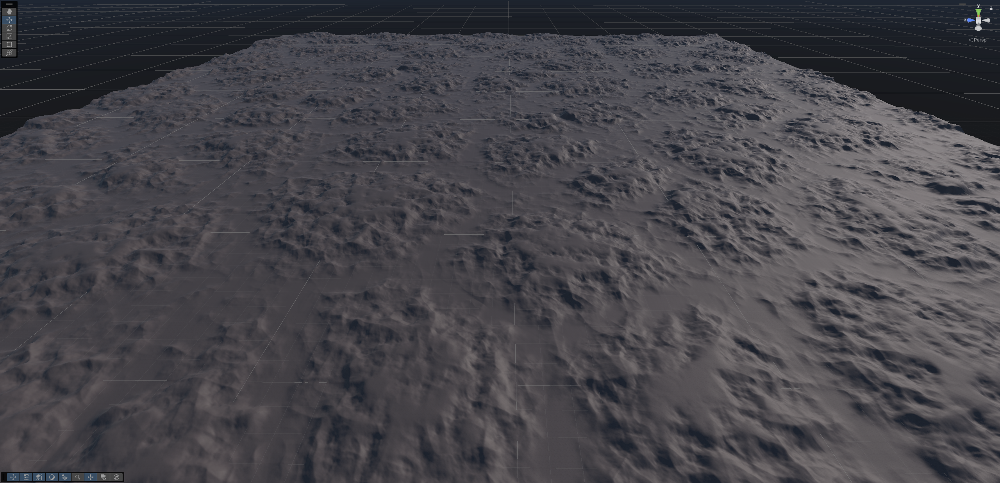

# Masterclass: Data-oriented memory-optimalisaties voor een procedurele terreingenerator

### Casper van Battum • Graduation HKU Game Development

---

---

Voor mijn afstudeerproject – Roots – heb ik een procedurele terreingenerator geschreven. Een uitdaging die ik hiervoor opgezocht heb was het optimaliseren van de generator: terrein moest tijdens het spelen van de game zonder haperingen geladen worden. 

Unity maakt het makkelijk om snel games te maken, maar daar staat tegenover dat je zelf wat extra werk moet doen om ook snelle games te maken. Met een beetje kennis van hoe de computer en programmeertalen werken valt er een hoop winst te behalen. Het doel van deze masterclass is om een goed beginpunt te leggen voor die kennis.

Door alle optimalisaties heen stond er een ding centraal: hoe ga je om met het geheugen? Feit is dat hier veel winst te behalen valt op moderne hardware. Daarom gaan we voornamelijk kijken naar hoe goed (of slecht) geheugengebruik mij heeft geholpen om een oppervlakte van 24km² verdeeld over 15 chunks in slechts 2ms te genereren. En was dat proces het ook daadwerkelijk waard?

## Wat ga je leren?
Je zal in deze masterclass leren hoe het bijhouden en bewaren van data de performance van je game beïnvloedt. Dit doen we door eerst naar de basis te kijken van memory-management in C# en Unity, en vervolgens een aantal voorbeelden uit mijn project te bekijken waar ik deze concepten toegepast heb om een performance bottleneck op te lossen. Het is niet bedoeld als tutorial om mee te volgen, maar als uitgangspunt om verder te leren over de concepten van geheugenmanagement. 

Ik gebruik drie voorbeelden uit mijn project om drie verschillende onderwerpen uit te lichten:

- Memory hergebruiken
- Code ontwerpen voor memory/cache locality
- Unity native memory (inclusief een kort stukje over GPU buffers)

Deze masterclass gaat uit van **Unity 6.1**. Hoewel ik Unity gebruik als context voor de code in deze masterclass, zijn de principes toepasbaar op alle engines. Memory werkt uiteindelijk hetzelfde op elke computer, voor elk programma. Zelfs non-game software kan hier winst behalen. De principes komen uit data-oriented design, een tegenhanger van het welbekende object-oriented design die steeds meer gebruikt wordt in games.

## Voorkennis

- Je kunt met C# programmeren, of een vergelijkbare programmeertaal.
- Basiskennis van pointers/references zoals in C/C++, Rust, of een vergelijkbare programmeertaal.
- Je weet wat de game loop van een engine is en wat het concept van een frame is.
- Je kan je weg vinden in Unity.
  - Inclusief het gebruik van de profiler (zo niet staan er resources in het volgende hoofdstuk).

## Inhoud

- **Intro**
- Basis:
  - [Performance-doelen & profiler](2-frametimes-profiler.md)
  - [C# data types & garbage collector](3-references-gc.md)
- Foliage updaten: data locality
- Jobs voor parallel genereren: native memory
- Chunks poolen: hergebruiken van memory
- Afsluiting en verder lezen
