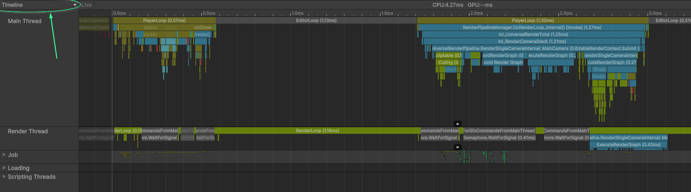
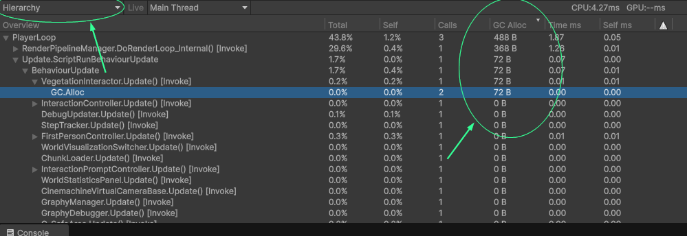
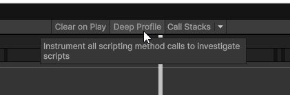
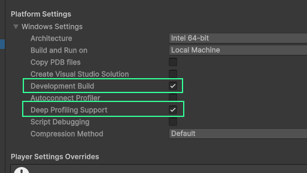

# Performance-doelen en de profiler

---

[←](1-intro.md) • [Intro](1-intro.md) • **Frametimes** • [References, GC](3-references-gc.md) • [Geheugen hergebruiken](4-chunk-pooling.md) • [Geheugen-layout](5-layout.md) • [Afsluiting](9-afsluiting.md) • [→](3-references-gc.md)

---

Bij het werken aan een game wil je van tevoren een doel opstellen voor welke snelheid je game moet hebben. De meest bekende maat voor het meten van de snelheid van games is FPS, frames per seconde, ook wel framerate genoemd. De framerate hangt af van de hardware waar de game op moet draaien en de snelheid van de code. Voordat je je code gaat optimaliseren moet je eerst nagaan of dit wel nodig is, en dit test je aan de hand van dit doel. Tijdens het optimaliseren wil je ook kunnen testen of je optimalisaties daadwerkelijk doen wat ze moeten doen.

We gaan in dit deel een alternatieve manier bekijken om de snelheid in te meten die beter inzicht geeft in de snelheid van je code, namelijk de frametime. Daarnaast gaan we ook even snel de profiler van Unity bekijken, omdat we deze later nodig gaan hebben.

## Frametime
Om te zorgen dat het beeld vloeiend is moet elke nieuwe afbeelding van de game (frame) binnen een bepaalde tijd klaar zijn. Als je 30 frames per seconde wilt laten zien (30 FPS), dan heb je hooguit één dertigste van een seconde de tijd om de frame te maken. Dit is (net iets meer dan) 33 milliseconde (`1s / 30 = 0,0333…s ≈ 33ms`). De pure tijd die het kost om een frame te maken noemen we de **frametime**. Hoe langer het duurt om een frame te maken, hoe minder je er per seconde kunt laten zien, en hoe lager je FPS dus wordt. Het **framebudget** is de maximale frametime.

> **Tip**\
> Voor games wordt framerate vaak uitgedrukt in FPS, maar de standaard-eenheid voor "keer per seconde" (frequentie) is Hz (hertz). Dit zul je vaak zien op monitors of TV's. Een monitor van 120Hz kan 120 beelden per seconde weergeven, ofwel, 120 frames per seconde. Hz en FPS betekenen hetzelfde in de context van games.

Game developers die bezig zijn met optimalisatie rekenen vaak liever met de frametime dan met de framerate van een spel:

- De frametime is simpelweg de som van de tijd die het duurt om alle functies uit te voeren en dit is een-op-een te vergelijken met je budget: als de functies samen 5ms duren, en je budget is 33ms, dan past je frame binnen het budget met nog 28ms over.

- Een framerate kan alleen berekend worden als een gemiddelde over tijd. Feitelijk is de framerate het gemiddelde aantal frames over een tijdsduur van één seconde. Dit zegt weinig tot niets over de tijd die elk individueel frame kost; het gemiddelde trekt die recht. Om een vloeiende ervaring te maken is het juist belangrijk om te zorgen dat elk individueel frame binnen het budget blijft.

### Framebudget kiezen
Het kiezen van een goed framebudget hangt af van een aantal factoren. Het soort game is het meest bepalend: een casual- of simulatie-game blijft goed speelbaar met FPS onder de 60 (hierbij hoort een frametime van 16.7ms), terwijl een shooter of een competitief spel vaak pas vanaf 60FPS als speelbaar wordt ervaren.

De hardware van de speler is ook van belang: monitoren zijn gelimiteerd in het aantal beelden dat ze kunnen weergeven per seconde. De meeste laptop- of kantoormonitoren zullen een frequentie hebben van 60 of 75, soms 100FPS, terwijl specialistische game-monitoren vaak 120, 144 of zelfs nog hoger aankunnen.

Je kunt het framebudget ook bijstellen om voor meer of minder krachtige hardware te corrigeren. Stel je hebt een supercomputer waar je op test en je verwacht dat je gebruikers gemiddeld slechtere computers gaan hebben, dan is het slim om te zeggen dat het op jouw computer veel sneller moet draaien dan dat je wil op de computer van je gebruiker. Pas hiermee wel op, want hardware schaalt vaak niet lineair met snelheid. Zo’n correctie is dus geen vervanging voor het af en toe testen op de hardware van gebruikers.

De gebruiker zal snelheid uiteindelijk vooral merken op twee vlakken: de verversingssnelheid van de beelden op hun scherm, en de **latency** van hun inputs; ofwel de reactiesnelheid van de game op hun acties. Deze twee factoren zijn onafhankelijk van elkaar: een game die gespeeld wordt op een monitor van 60Hz terwijl de framerate waarop de game draait hoger is, zal sneller reageren dan een game die ook daadwerkelijk op 60FPS draait.

Hieronder een tabel met de veelgebruikte waarden voor frametimes, en de framerates die erbij horen, evenals de scenario's waarin die waarden vaak gebruikt worden.

| Frametime | Framerate  | Scenario                                                                                                                                                                   |
|-----------|------------|----------------------------------------------------------------------------------------------------------------------------------------------------------------------------|
| 33ms      | 30FPS      | Oudere consoles of mobiele apparaten.                                                                                                                                      |
| 16.7ms    | 60FPS      | Meest voorkomende framerate van monitors; framerate van moderne consoles.                                                                                                  |
| 17-10ms   | 60-100FPS  | De gemiddelde snelheid die de meeste gebruikers verwachten van hun games.                                                                                                  |
| 10-5ms    | 100-200fps | Interessant voor games waar snelheid belangrijk is, bijvoorbeeld shooters die op 144Hz+ monitors gespeeld worden.                                                          |
| <5ms      | \>200FPS   | Zeldzaam nodig; weinig monitors ondersteunen zulke hoge framerates, en bovendien wordt het verschil in latency steeds minder goed merkbaar tussen steeds hogere snelheden. |

## Profiler

We gebruiken de profiler in Unity voor het meten van de performance van een game. De profiler meet per frame onder andere de frametime en het geheugengebruik, naast nog veel andere dingen. Je vindt de profiler in het menu `Window > Analysis > Profiler`. Als je nog nooit met de profiler hebt gewerkt is het handig om hier eerst even bekend mee te worden, bijvoorbeeld met deze video van Unity: https://www.youtube.com/watch?v=xjsqv8nj0cw. Hier worden ook een paar eigenaardigheden in benoemd waar je je bewust van moet zijn als je je eigen games gaat profilen.

> **Tip**\
> Je hebt in het `Window > Analysis` menu ook een optie voor `Profiler (Standalone Process)`. Dit is de optie die ik zelf liever gebruik. De ingebouwde profiler kan de hele editor, inclusief game, langzamer maken. Bovendien kan de standalone profiler gewoon functioneel blijven als Unity ergens mee bezig is of blijft hangen.

### Frames bekijken

De profiler geeft aan welke functies er aangeroepen worden tijdens een frame. De timeline-view geeft een indruk welke functies op welk moment in de frame gebeuren, hoe lang functies duren, wat de volgorde is, en wat de hiërarchie is. Je kunt hierin zoomen en scrollen:

De Hierarchy-view laat meer pure data zien. Deze is vooral interessant voor deze masterclass, omdat hier ook aangegeven wordt hoeveel geheugen er in een frame wordt toegewezen (omcirkelde kolom, onder 'GC Alloc'):

Deze functie gaan we later gebruiken om het geheugengebruik te controleren.

### Deep profiling

Bij standaard-profiling wordt er enkel een overzicht gegeven van de functies die gedraaid worden. Deep profiling is een functie om letterlijk elke functie te kunnen zien in de profiler. Deze functie staat standaard uit, omdat dit erg veel rekenkracht kost en de performance van je game zal vernietigen. Deep profiling is voor twee scenario's interessant:

- Je wilt weten welke calls in jouw functies meer tijd innemen dan anderen (relatief)
- Je wilt weten welke specifieke functies geheugen opvragen

Deep profiling zal je game erg traag maken, dus je kunt het niet gebruiken om de daadwerkelijke tijd van functies te achterhalen. Zelfs de standaard-profiler geeft een iets vertekend beeld, maar dit is een veel minder groot probleem. Door deep profiling kunnen de frames wel 5 tot 10 keer zo lang duren, terwijl de standaard profiler frames slechts enkele procenten langer maakt.

Deep profiling zet je aan met de "Deep profile"-knop bovenin. Dit zorgt ervoor dat de game opnieuw gecompileerd moet worden.

Als je een build wilt deep-profilen, moet je het aanzetten op het moment dat de build gemaakt wordt, door in de build settings "Development build" en "Deep profiling support" aan te zetten.

## Samenvatting

- Tijdens het optimaliseren kijken we liever naar de frame*time* dan de frame*rate* van een game:
    - Frametime is simpelweg de tijd die het duurt om een frame te maken, vaak uitgedrukt in milliseconde (ms).
    - De framerate laat een gemiddelde zien en zegt niets over de uitschieters.
- We noemen de maximale tijd die een frame max duren het framebudget.
- We gebruiken de profiler om te kijken of onze frames binnen de minimale framebudget en hoeveel geheugen er vrijgemaakt wordt tijdens een frame.
    - We kunnen deep profiling gebruiken om preciezer te kunnen zien welke functies zorgen voor geheugengebruik.

---

Volgende deel: [C# data types & garbage collector →](3-references-gc.md)