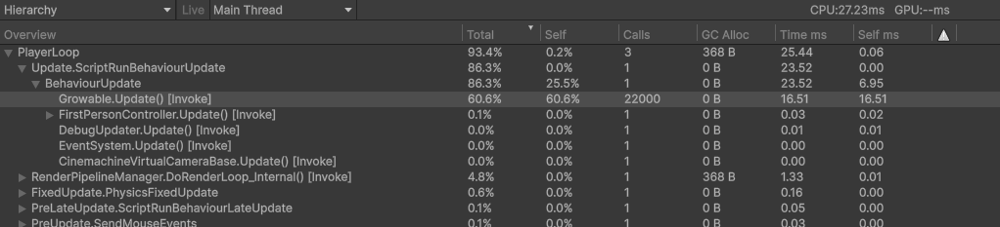
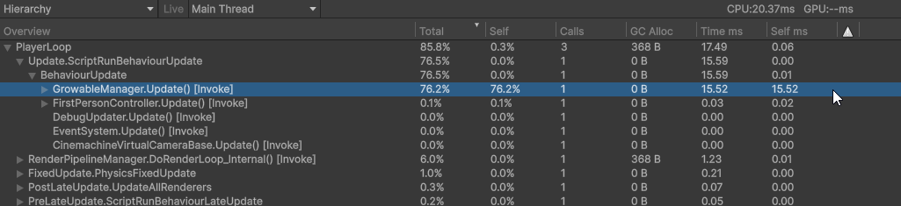
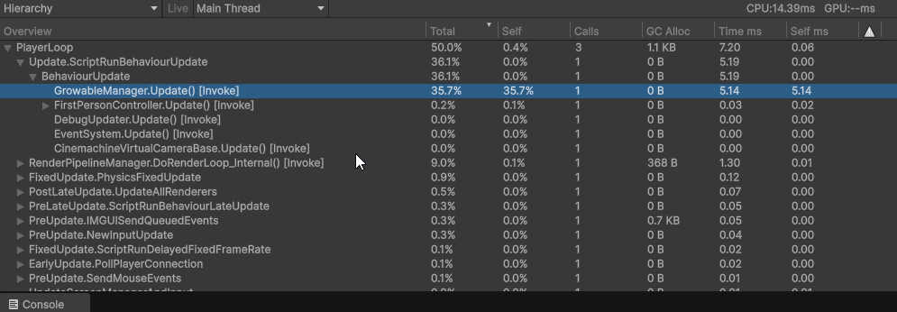
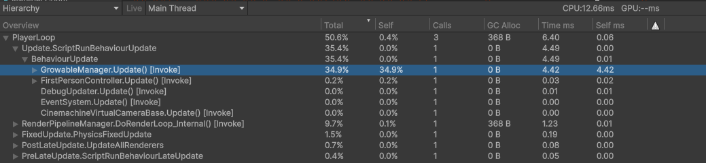

# Geheugen-layout

---

[←](4-chunk-pooling.md) • [Intro](1-intro.md) • [Frametimes](2-frametimes-profiler.md) • [References, GC](3-references-gc.md) • [Geheugen hergebruiken](4-chunk-pooling.md) • **Geheugen-layout** • [Afsluiting](9-afsluiting.md) • [→](9-afsluiting.md)

---

Als je veel van dezelfde data achter elkaar moet verwerken is het belangrijk dat dit snel gaat. Veel data betekent immers ook veel werk, dus we willen zo min mogelijk tijd besteden aan zaken die niet van belang zijn. Ons tijdsbudget is tenslotte maar beperkt. De manier waarop we ons geheugen indelen is hierbij van groot belang. We gaan in dit deel kijken waarom dit zo belangrijk is, en hoe we dit slim aanpakken. 

## Voorbeeldproject

Je kunt het voorbeeldproject voor deze pagina hier vinden: [Sample_MemoryLayoutOptimization.zip](Sample_MemoryLayoutOptimization.zip). Dit is een stripped-down versie van (een eerdere versie van) Roots. Het project is gemaakt met Unity 6000.1.1f1. Je kunt het project gebruiken om de veranderingen aan de code zelf te implementeren, en de effecten ervan zelf te meten met de profiler. Beweeg met WASD.


## Layout

In mijn project wilde ik bomen maken die groeiden als de speler dichterbij kwam. Er zitten duizenden punten in een chunk waar een boom kan groeien, en elk moet apart kijken hoe ver weg de speler is om te bepalen of die moet groeien. 

Een eerste implementatie hiervan kan zo simpel zijn als dit: Je maakt een `Growable`-component, en je maakt een GameObject op elk punt waar een boom gaat groeien waar dit component op zit:

```csharp
public class Growable : MonoBehaviour
{
    [SerializeField] private Transform player;

    [SerializeField] private float maxDistance;
    [SerializeField] private float minDistance;
    [SerializeField] private bool keepMaxProgress;

    private Renderer renderer;

    [SerializeField] private float progress = 0;
    private float maxProgress;

    private void Awake()
    {
        renderer = GetComponentInChildren<Renderer>();
        player = GameObject.FindWithTag("Player").transform;
    }

    private void Update()
    {
        progress = GetCurrentProgress();
        maxProgress = math.max(progress, maxProgress);

        if (keepMaxProgress)
        {
            transform.localScale = Vector3.one * maxProgress;
            renderer.enabled = maxProgress != 0;
        }
        else
        {
            transform.localScale = Vector3.one * progress;
            renderer.enabled = progress != 0;
        }
    }

    private float GetCurrentProgress()
    {
        Vector3 playerPos = player.transform.position;
        playerPos.y = 0;
        Vector3 objectPos = transform.position;
        objectPos.y = 0;
        float distance = Vector3.Distance(objectPos, playerPos);
        distance = math.clamp(distance, minDistance, maxDistance);

        return math.remap(maxDistance, minDistance, 0, 1, distance);
    }
}
```

Achter de schermen gaat Unity nu elk GameObject langs met dit component, en wordt de `Update()`-functie aangeroepen. We kunnen even meten hoe lang dit duurt:


De ~22,000 bomen die in de wereld zijn doen er gezamenlijk meer dan 16ms over om te updaten, meer dan de helft van alle tijd van het frame! En dat terwijl de code helemaal niet zo ingewikkeld is. Wat is hier aan de hand?

### Overhead

Het aanroepen van `Update()` kost extra tijd. Unity moet allerlei dingen doen om die `Update()` aan te roepen, zoals het vinden van de juiste objecten, of controleren of het object nog wel bestaat sinds vorig frame. Dit kost tijd. Omdat wij zelf weten welke objecten geüpdate moeten worden, en we zelf weten dat ze allemaal blijven bestaan tussen frames door, kunnen wij zelf die verantwoordelijkheid van Unity overnemen. We kunnen alle `GrowableTree` in een lijst stoppen, en zelf een handmatige update-functie aanroepen. We houden dit bij in een aparte GrowableManager:

```csharp
public class GrowableManager : MonoBehaviour
{
    [SerializeField] private Growable prefab;
    [SerializeField] private Vector2 xBound;
    [SerializeField] private Vector2 yBound;
    [SerializeField] private int objectCount;

    private List<Growable> growables;
    
    private void Start()
    {
        // Maak een lijst om de objecten in te bewaren
        growables = new List<Growable>(objectCount);
        
        // Maak de objecten aan en stop ze in de lijst
        for (int i = 0; i < objectCount; i++)
        {
            Growable obj = Instantiate(prefab, transform);
            obj.transform.position = new Vector3(Random.Range(xBound.x, xBound.y), 0, Random.Range(yBound.x, yBound.y));
            growables.Add(obj);
        }
    }

    private void Update()
    {
        // Elke update roepen we op één centrale plek aan
        foreach (var growable in growables)
        {
            growable.ManualUpdate();
        }
    }
}
```

Als we nu nog eens naar de profiler kijken zien we dat er eigenlijk geen groot verschil is. Wat oorspronkelijk 16.5ms was, is nu 15.5ms. Een aantal frames komen zelfs nog steeds boven de 16ms uit. Er is meer nodig om het probleem op te lossen.


### Fragmentatie

Het probleem is dat alle objecten nu verspreid in het geheugen staan. Bij het aanmaken van het GameObject werd deze op een willekeurige plek in het geheugen gezet. Zodra we de waarden aan willen passen, moet de processor op elk adres in het geheugen langsgaan om de waarde aan te passen. Je kunt je een postbode voorstellen die ieder huis dat die moet bezoeken in willekeurige volgorde afgaat. Hij zal dan enorm veel tijd kwijt zijn met het heen-en-weer lopen tussen alle straten, terwijl hij ook gewoon zijn rondje straat voor straat af kan gaan. We noemen deze willekeurige verspreiding in het geheugen ook wel fragmentatie van de data.

Geheugen is een fysiek iets: het zijn cellen waarin data wordt opgeslagen. Net als huizen met adressen heeft het geheugen adressen (het memory-adres). Om te voorkomen dat de processor net als de postbode over het hele geheugen heen en weer moet lopen, kunnen we er voor zorgen dat alle data netjes naast elkaar in het geheugen staat. 

Dit kunnen we alleen maar doen door te werk te gaan met een array van value types. Onthoud dat wij geen controle hebben over waar een reference type terechtkomt. We moeten dit dus in onze eigen handen nemen, en dat kan alleen met value types. Om ze te verzamelen op één plek gebruiken we een array. Een array mag dan zelf een reference type zijn, maar als deze gevuld is met value types staat alle data direct naast elkaar in het geheugen. Zodra de processor bij het begin van de array is, kan deze meteen doorlopen naar het volgende element, en het element daarna. Ze zitten direct achter elkaar in het fysieke geheugen.

> **Tip**\
> Het is niet genoeg om alleen een array te gebruiken en een reference type te blijven gebruiken. Wat er dan gebeurt, is dat je allemaal geheugenadressen naast elkaar in het geheugen hebt staan, en dat het programma nog steeds al die adressen door het hele geheugen moet bezoeken. Bovendien heeft een `List<T>` intern ook een array waar de waarden in bijgehouden worden, wat precies hetzelfde effect heeft.

Als bijkomend voordeel kan de processor "rijen" van het geheugen in een soort speciaal geheugen laden (de **cache**) dat vele malen sneller is dan het gewone geheugen (dit proces heet **prefetching** en dit gebeurt automatisch). Hierdoor is het niet alleen efficiënter om bij alle data langs te gaan, maar is het ook nog eens vele malen sneller om de data daadwerkelijk te gebruiken.

In plaats van een MonoBehaviour-class maken we een struct om de `Growable` in bij te houden. We verplaatsen vervolgens alle logica van het updaten naar de `GrowableManager`
```csharp
public class GrowableManager : MonoBehaviour
{
    public struct GrowableInstance
    {
        public Transform transform; // We hebben nog steeds een reference nodig naar de transform voor het updaten van de positie.
        public Renderer renderer; // Het is efficienter om de renderer op te slaan dan om hem telkens opnieuw op te moeten vragen.

        public Vector3 position;
        public float progress;
        public float maxProgress;
    }

    [Header("Spawn settings")]
    [SerializeField] private GameObject prefab;
    [SerializeField] private Vector2 xBound;
    [SerializeField] private Vector2 yBound;
    [SerializeField] private int objectCount;

    // De waarden die we eerst apart bijhielden in elke Growable, houden we nu op één centrale plek bij
    [Header("Update settings")]
    [SerializeField] private Transform player;

    [SerializeField] private float maxDistance = 15;
    [SerializeField] private float minDistance = 5;
    [SerializeField] private bool keepMaxProgress = true;

    private GrowableInstance[] growables; // Verander List<Growable> in een Growable[] array

    private void Awake()
    {
        player = FindFirstObjectByType<FirstPersonController>().transform;
    }

    private void Start()
    {
        growables = new GrowableInstance[objectCount]; // Maak de array groot genoeg voor het aantal objecten

        for (int i = 0; i < objectCount; i++)
        {
            GrowableInstance growable = new();
            // We houden alsnog een reference bij naar de transform, maar omdat dit een Unity-object is, is dit onvermijdelijk
            growable.transform = Instantiate(prefab, transform).transform;
            growable.transform.position = new Vector3(Random.Range(xBound.x, xBound.y), 0, Random.Range(yBound.x, yBound.y));
            // Kopieer de positie naar een value type direct in de struct, deze gaat nooit veranderen want bomen kunnen niet lopen
            growable.position = growable.transform.position; 

            // Om te voorkomen dat we ieder frame nóg een reference moeten opvragen naar de Renderer, cachen we ook deze:
            growable.renderer = growable.transform.GetComponentInChildren<Renderer>();

            // Stel de start waarden in
            growable.progress = 0;
            growable.maxProgress = 0;

            // Sla de waarde op in de array
            growables[i] = growable;
        }
    }

    private void Update()
    {
        // We kunnen player nu één keer per frame opvragen, in plaats dat het opnieuw moet voor iedere growable
        Vector3 playerPos = player.transform.position;
        playerPos.y = 0;

        for (int i = 0; i < growables.Length; i++)
        {
            UpdateGrowable(i, playerPos);
        }
    }

    private void UpdateGrowable(int i, Vector3 playerPos)
    {
        // Door de waarde uit de array te halen maken we een lokale kopie om aan te passen.
        // We kunnen de waardes niet direct in de array aanpassen.
        GrowableInstance growable = growables[i];

        // We kunnen direct de opgeslagen positie gebruiken, en we hoeven niet door transform.position heen
        Vector3 objectPos = growable.position;
        objectPos.y = 0;

        float distance = Vector3.Distance(objectPos, playerPos);
        distance = math.clamp(distance, minDistance, maxDistance);

        float progress = math.remap(maxDistance, minDistance, 0, 1, distance);

        float maxProgress = math.max(progress, growable.maxProgress);

        // Sla de lokale aanpassingen op in de array
        growable.progress = progress;
        growable.maxProgress = maxProgress;
        growables[i] = growable;

        // Pas meteen de waarden in de wereld aan
        if (keepMaxProgress)
        {
            growable.transform.localScale = Vector3.one * maxProgress;
            growable.renderer.enabled = maxProgress != 0;
        }
        else
        {
            growable.transform.localScale = Vector3.one * progress;
            growable.renderer.enabled = progress != 0;
        }
    }
}
```

In de comments kun je meteen een aantal optimalisaties zien die deze manier van werken nog meer oplevert. Als we nu de profiler erbij pakken, zien we dat de functie wel degelijk sneller is geworden:



We zijn van 16ms naar rond de 5ms gegaan, meer dan 3x zo snel! Dit komt puur omdat de data allemaal dicht bij elkaar staat. De berekeningen zijn immers bijna hetzelfde gebleven.

### Array-of-structs versus struct-of-arrays

Als de computer graag werkt met data die dicht bij elkaar ligt, moet de data klein genoeg zijn om in de cache (het interne geheugen van de processor) te passen. Hoe groter de losse stukjes data in je array zijn, hoe moeilijker het wordt om er veel tegelijk in dit zeer beperkte geheugen te passen. In gevallen waar je data groter is, is het dan ook vaak efficiënter om niet één array van structs met je data bij te houden, maar om meerdere arrays bij te houden voor elk element van je data. Je loopt dan telkens over slechts enkele arrays tegelijk heen om zo te voorkomen dat je cache volloopt met dingen die je op dat moment niet nodig hebt.

Hieronder zie je de array-of-structs-methode (AoS) die we hierboven ook gebruikt hebben. Je houdt één array bij waar alle data achter elkaar in zit:
```csharp
public struct MyUpdateData 
{
    public Vector3 position;
    public float number;
}

public class Updater : MonoBehaviour 
{
    private MyUpdateData[] updateData = new MyUpdateData[40000];
}
```
```
Geheugenlayout:
--------------------------------------------
| pos1 | num1 | pos2 | num2 | pos3 | num 3 |
- ^ ----------- ^ ----------- ^ ------------
  i1            i2            i3  
```

Als we dit omdraaien krijgen we de struct-of-arrays-methode (SoA). In een struct houden we meerdere arrays bij waar alle data van elk type apart zit:

```csharp
public struct MyUpdateData 
{
    public Vector3[] positions;
    public float[] numbers;
}

public class Updater : MonoBehaviour 
{
    private MyUpdateData updateData = new();
    
    private void Awake() 
    {
        updateData.positions = new Vector3[40000];
        updateData.numbers = new float[40000];
    } 
}
```
```
Geheugenlayout:
----------------------
| pos1 | pos2 | pos3 |
- ^ ---- ^ ---- ^ ----
  i1     i2     i3 
----------------------
| num1 | num2 | num3 |
- ^ ---- ^ ---- ^ ----
  i1     i2     i3 

```

Als je in een loop alleen de positions nodig hebt, gebruikt dit dus veel minder ruimte dan de AoS methode. 

> **Tip**\
> Let wel op: als je ze altijd beide onderdelen nodig gaat hebben maakt dit niet veel uit en is het soms zelfs efficiënter om wél een array-of-struct. De verschillende arrays zelf staan immers op verschillende willekeurige plekken in het geheugen, en dit kan langzamer zijn dan wanneer alle data op dezelfde plek staat. Hoe groter de je data, hoe waarschijnlijker het is dat SoA sneller is dan AoS. 

We kunnen dit ook proberen te implementeren bij onze `Growables`.

```csharp
public class GrowableManager : MonoBehaviour
{
    // ...

    // In plaats van de GrowableInstance[] houden we losse arrays bij voor de verschillende waarden
    private Vector3[] positions;
    private float[] maxProgresses;
    private Transform[] transforms;
    private Renderer[] renderers;

    // ...

    private void Start()
    {
        // Maak de arrays aan
        positions = new Vector3[objectCount];
        maxProgresses = new float[objectCount];
        transforms = new Transform[objectCount];
        renderers = new Renderer[objectCount];

        for (int i = 0; i < objectCount; i++)
        {
            // Maak het object en sla de data op
            Transform obj = Instantiate(prefab, transform).transform;
            renderers[i] = obj.transform.GetComponentInChildren<Renderer>();
            transforms[i] = obj;

            obj.position = new Vector3(Random.Range(xBound.x, xBound.y), 0, Random.Range(yBound.x, yBound.y));
            positions[i] = obj.transform.position;

            // Stel de startwaarden in
            maxProgresses[i] = 0;
        }
    }

    private void Update()
    {
        Vector3 playerPos = player.transform.position;
        playerPos.y = 0;

        for (int i = 0; i < objectCount; i++)
        {
            UpdateGrowable(i, playerPos);
        }
    }

    private void UpdateGrowable(int i, Vector3 playerPos)
    {
        // We halen de losse waarden uit de losse arrays
        Vector3 objectPos = positions[i];
        objectPos.y = 0;

        float distance = Vector3.Distance(objectPos, playerPos);
        distance = math.clamp(distance, minDistance, maxDistance);

        float progress = math.remap(maxDistance, minDistance, 0, 1, distance);

        float maxProgress = math.max(progress, maxProgresses[i]);
        maxProgresses[i] = maxProgress;
            
            
        if (keepMaxProgress)
        {
            transforms[i].localScale = Vector3.one * maxProgress;
            renderers[i].enabled = maxProgress != 0;
        }
        else
        {
            transforms[i].localScale = Vector3.one * progress;
            renderers[i].enabled = progress != 0;
        }
    }
}
```

Als we dit weer profilen zien we een klein maar consistent verschil, van ~5.15ms naar ~4.42ms:


De beperkte grootte van het verschil is vooral te verklaren doordat de data hier slechts heel klein is, en alle data gebruikt wordt in de enige for-loop. Bij verschillende for-loops bij op verschillende stukjes van de data werken kan het verschil al beter zichtbaar worden. Toch moet je bij jezelf nagaan of deze optimalisatie de moeite waard is ten opzichte van de wat overzichtelijkere array-of-structs-methode.

## Verdere optimalisatie

We zitten nu nog altijd met 5ms aan functietijd, en dat is vrij veel van een 16.7ms budget (ongeveer een derde). Dit kan nog verder geoptimaliseerd worden. Unity biedt hier twee goede features voor: Jobs (+Burst) en ECS. Hoewel de implementatie hiervan buiten de scope van deze masterclass valt, kunnen ze niet ontbreken uit deze masterclass. Deze features (die allemaal in Unity's Data-Oriented technology stack (DOTS) zitten) zijn namelijk ontworpen om de bovenstaande layout-technieken nog breder en efficiënter toe te passen.

- ### Jobs
    Unity Jobs is een feature om code parallel uit te voeren (met multithreading). Multithreading in games is alleen interessant voor grote hoeveelheden data, zoals onze 22.000 bomen, want uiteindelijk moet alles alsnog gesynchroniseerd worden op de lineaire game thread, ieder frame. Om Jobs zo snel te maken, vragen ze om exact dezelfde layout die we hierboven ook toegepast hebben: je slaat de data op in een array*, de job-code voert berekeningen uit, de resultaten worden opgeslagen in diezelfde array (of een andere, afhankelijk van de AoS of SoA layout), en als de job klaar is kan je de data weer gebruiken in je game.\
    Meer info: https://docs.unity3d.com/Manual/job-system.html
    > ***Tip**\
    Unity gebruikt voor jobs geen standaard arrays, maar een speciaal type `NativeArray<T>` ([docs](https://docs.unity3d.com/ScriptReference/Unity.Collections.NativeArray_1.html)). Dit type is speciaal gemaakt om te werken met multithreading, nodig voor jobs en iets dat niet kan met de standaard C# array, en om buiten de garbage collector heen te werken. Je kunt deze dus aanmaken zonder dat de garbage collector deze later weer op moet ruimen! Maar let op, het vrijmaken van geheugen voor zo'n lijst kost nog altijd tijd. Het is dus nog altijd beter om deze lijsten te hergebruiken. 
- ### Burst
    Burst is een speciale compiler voor jobs die probeert om speciale CPU-instructies te genereren waarmee meerdere berekeningen tegelijk uitgevoerd kunnen worden op een enkele CPU-core. Deze zogenaamde SIMD-instructies (same instruction, multiple data) werken het best als alle data direct naast elkaar staat, zoals we in dit hoofdstuk toegepast hebben. Burst profiteert bij uitstek van de SoA-architectuur.\
    Meer info: [Unity Burst docs](https://docs.unity3d.com/Packages/com.unity.burst@1.8/manual/index.html), [SIMD - Wikipedia](https://en.wikipedia.org/wiki/Single_instruction,_multiple_data)
- ### ECS
    In onze code gebruiken we nog altijd reference types voor `Renderer` en `Transform`. Dit is onvermijdelijk, omdat we deze classes niet kunnen omtoveren in structs. In een ideale wereld willen we deze types toch ook veranderen in value types. De ECS-architectuur (afgekort van entity-component system) is hier het antwoord op. ECS zorgt ervoor dat óók de data uit componenten als `Renderer` en `Transform` naast elkaar in het geheugen kunnen staan, en alleen wanneer dit nodig is. \
    ECS is niet uniek in Unity. Er zijn zelfs voor Unity verschillende mogelijke opties om te gebruiken, naast Unity's eigen ECS. Daarnaast kan een ECS toegepast worden op slechts een klein deel van de game-wereld, en hoeft niet alles op de ECS-architectuur te draaien.\
    Meer info: [ECS - Wikipedia](https://en.wikipedia.org/wiki/Entity_component_system), [Unity ECS docs](https://docs.unity3d.com/Packages/com.unity.entities@1.3/manual/index.html)
- ### Compute shaders
    Net als Unity Jobs bieden compute shaders de mogelijkheid om berekeningen in groten getale te parallelliseren. In tegenstelling tot Jobs (die op de CPU uitgevoerd worden) worden compute shaders op de GPU uitgevoerd. Net als Jobs werkt een compute shader op een grote lijst aan uniforme data, en past deze data aan of verwerkt het tot nieuwe data. De data moet fysiek naar de GPU verplaatst worden, en waar een CPU arrays gebruikt, gebruikt een GPU buffers. Gebruik een `GraphicsBuffer` (vervanging van de oudere `ComputeBuffer`) om je data voor je compute shader in op te slaan, grotendeels op dezelfde manier als bij onze eigen array-of-structs. Om de data voor te bereiden voor de GPU zijn er een paar extra stappen nodig die je kunt vinden in de documentatie. Alternatief wordt ook `RenderTexture` gebruikt voor communicatie tussen een compute shader en C# code, met als grote verschil dat de data in een render texture altijd uit 3 of 4 getallen (float of int) bestaat.\
    Meer info: [Compute shader (OpenGL wiki)](https://www.khronos.org/opengl/wiki/Compute_Shader), [Unity Compute Shader docs](https://docs.unity3d.com/Manual/class-ComputeShader.html), [Unity GraphicsBuffer](https://docs.unity3d.com/6000.1/Documentation/ScriptReference/GraphicsBuffer.html)

## Samenvatting

We hebben in dit deel gezien hoe de layout van data in het geheugen de performance kan verbeteren. 

- Als data fysiek naast elkaar staat, kost het veel minder tijd om de data te gebruiken.
- Data kan fysiek naast elkaar gezet worden door value types in arrays te zetten volgens een van de twee methodes:
  - Array-of-structs: alle data van elk object staat in één array achter elkaar.
  - Struct-of-arrays: elk stukje data van het object staat in een aparte array achter elkaar.
- Betere memory layout geeft niet alleen direct een performance boost, het is ook de voorwaarde voor verdere optimalisatie met Jobs, Burst of ECS.

---

Volgende deel: [Afsluiting →](9-afsluiting.md)