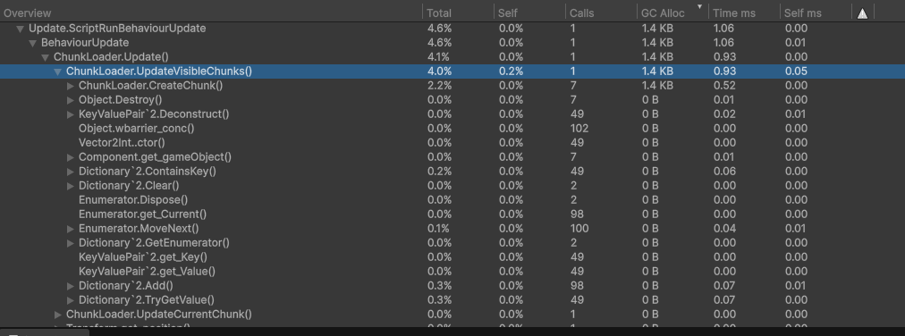

# Geheugen hergebruiken

Een game-wereld bevat zeer veel data. Een stukje terrein van 10 bij 10 meter bevat al gauw 400-1600 vertices. Om een beetje in de verte te kunnen kijken wil je een omgeving in een straal van ongeveer 1km tot 3km om je heen laden. Een stuk wereld van 4km bij 4km kan makkelijk honderden miljoenen vertices bevatten. Voor allerlei redenen is het slim om dit op te breken in kleinere stukjes, die in jargon chunks genoemd worden. Chunks worden in een bepaalde radius om de speler heen geladen, en als de speler zich verplaatst worden oude chunks vergeten en nieuwe gemaakt.

Mijn eerste implementatie van een chunk-systeem was ultra-simpel. Gemaakt voor snel resultaat, niet voor goede performance. De verantwoordelijkheid van dit component is om de geladen chunks bij te houden, en om nieuwe chunks te maken als de speler over een chunk-grens heenloopt.

## De `ChunkLoader`

Een `Chunk` is een MonoBehaviour component waar data over de chunk in wordt opgeslagen. De `ChunkLoader` is verantwoordelijk voor het aanmaken van `Chunks`. Zie hieronder een suboptimale versie van mijn `ChunkLoader`. Chunks worden opgeslagen in een `Dictionary<Vector2Int, Chunk> loadedChunks`, waarbij elke chunk een coördinaat (`Vector2Int`) toegewezen krijgt om ze snel terug te kunnen vinden. In `UpdateVisibleChunks()` wordt er gekeken welke chunks er nodig zijn gebaseerd op de huidige positie van de speler, en worden er nieuwe chunks aangemaakt terwijl de oude verwijderd worden.

Hoewel deze code werkt, wordt er heel inefficiënt gebruik gemaakt van het geheugen. We gaan deze code daarom als uitgangspunt gebruiken om een beter geoptimaliseerde `ChunkLoader` te schrijven.

```csharp
public class ChunkLoader : MonoBehavior {
    
    private Dictionary<Vector2Int, Chunk> loadedChunks;
    
    // ... //
    
    private void UpdateVisibleChunks()
    {
        Dictionary<Vector2Int, Chunk> newChunks = new();
        
        // Create new chunks
        for (int x = -loadRadius; x < loadRadius + 1; x++)
        {
            for (int z = -loadRadius; z < loadRadius + 1; z++)
            {
                Vector2Int key = new Vector2Int(x + playerChunkX, z + playerChunkZ);
                if (loadedChunks.TryGetValue(key, out var chunk))
                {
                    newChunks.Add(key, chunk);
                }
                else
                {
                    newChunks.Add(key, CreateChunk(x + playerChunkX, z + playerChunkZ));
                }
            }
        }
    
        // Invalidate and remove old chunks
        foreach (var (key, chunk) in loadedChunks)
        {
            if (!newChunks.ContainsKey(key))
            {
                Destroy(chunk.gameObject);
            }
        }
    
        // Update loaded chunks
        loadedChunks = newChunks;
    }
    
    private Chunk CreateChunk(int x, int z)
    {
        Chunk chunk = Instantiate(chunkPrefab, CalculateChunkCenter(x, z), Quaternion.identity, transform);
        chunk.gameObject.name = $"Chunk ({x}, {z})";
        chunk.LoadAt(x, z);
        return chunk;
    }
    
    // ... //
}
```
## Garbage

In deze implementatie gebeuren meer heap allocations dan nodig. Als oefening kun je nagaan of je zelf de drie allocations kunt vinden voor je verder leest.

1. Bij het aanmaken van een dictionary
    ```csharp
    ...
    private void UpdateVisibleChunks()
        {
            Dictionary<Vector2Int, Chunk> newChunks = new(); // << Heap allocation 1
            
            // Create new chunks 
            ...
    ```
   Dictionaries zijn reference types, dus ze worden opgeslagen op de heap. We maken elke keer dat de functie draait een nieuwe dictionary aan, die op een nieuwe willekeurige plek in het geheugen staat.
---
2. Bij het toevoegen van een item
    ```csharp
    ...
    if (loadedChunks.TryGetValue(key, out var chunk))
    {
        newChunks.Add(key, chunk); // << Heap allocation 2a
    }                
    else
    {
        newChunks.Add(key, CreateChunk(x + playerChunkX, z + playerChunkZ)); // << Heap allocation 2b
    }
    // NB. De if-else zorgt ervoor dat ofwel 2a, ofwel 2b altijd aangeroepen wordt, 
    // maar nooit allebei tegelijk. Het is dus feitelijk dezelfde allocation.
    ...
    ```
   Deze is een beetje gemeen, er is namelijk niet *altijd* een allocation als je `.Add(key, value)` op een dictionary aanroept. Als de capaciteit van de dictionary groot genoeg is, kan het element direct toegevoegd worden en vindt er geen allocation plaats. Maar als er geen ruimte is, moet de dictionary groeien. Dit kan alleen maar door de hele dictionary opnieuw te allocaten, met een grotere capaciteit (de capaciteit wordt in C# verdubbelt). Dan pas wordt het element toegevoegd.
---
3. Bij het aanmaken van een GameObject (`Instantiate()`)
    ```csharp
    private Chunk CreateChunk(int x, int z)
    {
        Chunk chunk = Instantiate(chunkPrefab, CalculateChunkCenter(x, z), Quaternion.identity, transform); 
                   // ^^ Heap allocation 3
        chunk.gameObject.name = $"Chunk ({x}, {z})";
        chunk.InitAt(x, z);
        return chunk;
    }
    ```
   Als je `Instantiate()` aanroept wordt er altijd een nieuw geheugen voor een GameObject, inclusief components, geallocate. Dit gebeurt in deze functie één keer voor elke nieuwe `Chunk` die gemaakt wordt.
   > **Tip**\
   In het bovenstaand stukje code zit zelfs nog een vierde allocation verstopt: `name = $"Chunk ({x}, {z})"` maakt ook gebruik van de heap. Dit is grotendeels onvermijdelijk als je werkt met strings, maar ook hier kun je optimaliseren. \
   *Meer info: https://medium.com/@johnklaumann/c-10-the-dark-and-evil-true-about-string-interpolation-29e10acc001b*
---
We kunnen ook duidelijk zien waar oude data als afval achtergelaten wordt

1. De oude dictionary wordt vernietigd door hem te overschrijven:
    ```csharp
    loadedChunks = newChunks; 
    ```
   De oude loadedChunks wordt overschreven met de nieuwe, waardoor de oude out-of-scope gaat en opgeruimd moet worden door de garbage collector. Je kunt je afvragen waarom de nieuwe niet gewoon de plek van de oude inneemt. Ten eerste is het nieuwe object al gemaakt, op een andere plek. Ten tweede overschrijf je alleen de referentie, omdat `Dictionary` een reference type is.
2. Het aanroepen van `Destroy(gameObject)` genereert ook afval dat opgeruimd moet worden
    ```csharp
    // Invalidate and remove old chunks
    foreach (var (key, chunk) in loadedChunks)
    {
        if (!newChunks.ContainsKey(key))
        {
            Destroy(chunk.gameObject); // << chunk.gameObject wordt hier afval
        }
    }
    ```

Als we de Unity profiler gebruiken kunnen we beter zien wat er gebeurt (en ook exact hoeveel memory er geallocate wordt):

Zoals je kunt zien wordt er voor de `CreateChunks()` functie 1.4KB vrijgemaakt, en de rest komt door de dictionaries.

## Objecten hergebruiken

We kunnen ervoor zorgen dat we dezelfde objecten hergebruiken, zodat we telkens maar één keer in de hele game een object hoeven aan te maken. We gaan kijken wat we kunnen doen voor zowel de `loadedChunks` dictionary, en de `Chunk` objecten zelf.

1. ### `loadedChunks` dictionary
Iedere verzameling heeft twee eigenschappen voor de grootte: `Length` of `Count`, en `Capacity`. De lengte geeft aan hoeveel elementen er op dit moment in de lijst zitten. De capaciteit geeft aan hoeveel elementen er in de lijst *kunnen* zitten. In feite is dit hoeveel geheugen de verzameling geclaimd heeft. In het geheugen ziet dit er ongeveer zo uit:

```csharp
List<int> myList = new List { 8, 15, 88, 47 }; // Capacity en Length zijn allebei 4

---------|geclaimed geheugen |--------------
 ## | ## | 08 | 15 | 88 | 47 | ## | ## | ##
---------|----- myList ------|--------------

myList.Capacity = 6; // maak de capaciteit 6, maar lengte blijft 4

---------|     geclaimed geheugen      |----
 ## | ## | 08 | 15 | 88 | 47 | ## | ## | ##
---------|---------- myList -----------|----
```

Een verzameling kan leeggemaakt worden met de functie `Clear()`. `Clear()` zorgt ervoor dat alle data in de verzameling gewist wordt, terwijl de capaciteit gelijk blijft. We kunnen dan het oude geheugen gebruiken om nieuwe data op te slaan. Omdat we tijdens het bepalen van welke chunks nieuw zijn we ook moeten weten welke chunks er al waren, hebben we alsnog altijd twee Dictionaries nodig om de functie te laten werken. Dit is hoe we dat kunnen doen:

```csharp
public class ChunkLoader : MonoBehavior {
    
    private Dictionary<Vector2Int, Chunk> loadedChunks;
    private Dictionary<Vector2Int, Chunk> tempChunks;
    
    public int ChunkCount => (loadRadius * 2 + 1) * (loadRadius * 2 + 1);
    
    private void Awake() 
    {
        loadedChunks = new Dictionary<Vector2Int, Chunk>(ChunkCount); // Maak een dictionary één keer aan met een capaciteit van het aantal chunks.
        tempChunks = new Dictionary<Vector2Int, Chunk>(ChunkCount); // Hou een tweede dictionary bij.
    }
    
    private void UpdateVisibleChunks()
    {
        tempChunks.Clear(); // In plaats van een nieuwe Dictionary maken, maak je de tijdelijke dict van vorige keer leeg
        
        // Create new chunks
        for (int x = -loadRadius; x < loadRadius + 1; x++)
        {
            for (int z = -loadRadius; z < loadRadius + 1; z++)
            {
                Vector2Int key = new Vector2Int(x + playerChunkX, z + playerChunkZ);
                if (loadedChunks.TryGetValue(key, out var chunk))
                {
                   tempChunks.Add(key, chunk); // Voeg de chunks die je nodig hebt toe
                }
                else
                {
                   tempChunks.Add(key, CreateChunk(x + playerChunkX, z + playerChunkZ));
                }
            }
        }
        
        // Invalidate and remove old chunks
        foreach (var (key, chunk) in loadedChunks) 
        {
            if (!tempChunks.ContainsKey(key))
            {
                Destroy(chunk.gameObject);
            }
        }
        
        // Update loaded chunks
        // Er is geen functie om direct de ene Dictionary naar de andere te kopiëren, 
        // dus doen we het handmatig door ieder paar van Vector2Int en Chunk toe te voegen.
        loadedChunks.Clear();
        foreach (var pair in tempChunks)
        {
            loadedChunks.Add(pair.Key, pair.Value);
        }
    }
}
```

We kunnen nu nog een keer de profiler gebruiken om te kijken of dit geholpen heeft:

We zien nu dat de enige plek waar nog memory geallocate wordt in de `CreateChunks()` functie is, waar de nieuwe GameObjects aangemaakt worden. Dat scheelt dus veel geheugen!

Wat we tegelijk ook kunnen zien is dat de totale tijd van de functie niet enorm omlaag is gegaan (1.18ms > 0.93ms). Die winst is niet noemenswaardig. Het belangrijkste doel van deze optimalisatie is niet dat we nu tijd besparen, maar dat ervoor zorgen dat er later geen tijd besteedt hoeft te worden aan het opruimen van het afval dat deze functie achterlaat.

Wat ook belangrijk is om mee te nemen is dat de nieuwe code meer geheugen in totaal gebruikt. In de originele versie is het geheugen alleen in gebruik tijdens de frame waarin de functie aangeroepen wordt, maar in de nieuwe functie is dit geheugen *altijd* geclaimd, ook tijdens alle frames waarin het niet nodig is. Dit kan opgelost worden door een ander algoritme te gebruiken waarbij je niet twee dictionaries nodig hebt, maar we kunnen dit ook voor lief nemen. Geheugen is er immers in overvloed op bijna alle moderne apparaten. Bedenk ook dat je apparaat sowieso het piekgeheugen aan moet kunnen, en dat het dus minder interessant is om te proberen het gemiddelde gebruik lager te maken.

> **Tip**\
> Je kunt een verzameling een start-capaciteit meegeven, zoals ik in de `Start()` van de nieuwe versie doe. Als je van tevoren al weet hoeveel elementen je moet gaan opslaan (wat hier het geval is), zorg je er zo voor dat je maar één keer geheugen hoeft vrij te maken. Je doet dit door de capaciteit in de constructor mee te geven: `new Dictionary<int, string>(capacity)`. Alleen deze optimalisatie zou al veel schelen in dit geval, zelfs zonder een tweede tijdelijke dictionary bij te houden, omdat de initiële capaciteit altijd 0 is. Zodra je één element toevoegt moet er dus al opnieuw memory geallocate worden. \
> *Meer info: https://stackoverflow.com/a/2760961/2274782*

2. ### `Chunk` GameObjects

Het aanmaken van GameObjects met `Instantiate()` (ook met `new GameObject()`) kost ook een allocation, zoals we konden zien in de profiler. Deze worden opgeruimd nadat we ze vernietigen. We kunnen dit voorkomen met een zogenaamde *pool*. Een pool is niets anders dan een verzameling objecten waar je er eentje uit kunt pakken als je hem nodig hebt, en weer terug kunt leggen als je ermee klaar bent. Vergelijk het met plastic tasjes in de supermarkt: je kunt elke keer een nieuw tasje kopen (`Instantiate()`) en weer weggooien als je hem gebruikt hebt (`Destroy()`), maar je kunt ze ook bewaren. Je moet ze wel één keer kopen, maar zolang ze niet scheuren kan je een verzameling bijhouden van tasjes die je kunt hergebruiken.

Als je in Unity objecten hebt die je telkens opnieuw tijdelijk gebruikt, wil je hiervoor eigenlijk altijd een pool-techniek gebruiken in plaats van aanmaken en vernietigen. Onze chunks zijn hier een voorbeeld van: een chunk is in gebruik terwijl deze in zicht is. Zodra hij uit zicht valt wordt hij vernietigt, terwijl er meteen een nieuwe aangemaakt wordt. Dit is zonde; we kunnen die oude chunk toch gewoon verplaatsen en nieuwe terrein-data meegeven?

Het idee om chunks te hergebruiken is simpel: we moeten eerst weten welke chunks niet meer nodig zijn, en vervolgens moeten we die verplaatsen naar een plek waar we een nieuwe chunk nodig hebben. Eenmaal daar, moeten we zorgen dat de chunk zich aanpast aan de nieuwe locatie, en niet gewoon de oude terrein-data meeneemt naar de nieuwe plek.

We gaan eerst kijken hoe we het aanmaken van chunks kunnen aanpassen. De `CreateChunk()` functie is niet meer nodig, en kunnen we vervangen met `ReinitializeChunk()`:

```csharp
private void ReinitializeChunk(Chunk chunk, int x, int z)
{
    chunk.gameObject.name = $"Chunk ({x}, {z})";
    chunk.LoadAt(x, z);
}
```
Deze functie gebruikt een bestaand `Chunk` object en stopt er de nieuwe data in. De objecten moeten nog steeds één keer aangemaakt worden, en nu dat niet meer in `CreateChunk()` gebeurt moeten we dit ergens anders doen. Hiervoor maken we een nieuwe functie `CreateChunks()` die we aanroepen in `Start()`:
```csharp
private void Start()
{
    CreateChunks();
}

private void CreateChunks()
{
    for (int x = -loadRadius; x < loadRadius + 1; x++)
    {
        for (int z = -loadRadius; z < loadRadius + 1; z++)
        {
            Vector2Int key = new Vector2Int(x + playerChunkX, z + playerChunkZ);
            Chunk chunk = Instantiate(chunkPrefab, CalculateChunkCenter(x, z), Quaternion.identity, transform);
            ReinitializeChunk(chunk, x, z);
            loadedChunks.Add(key, chunk);
        }
    }
}
```
In de originele code werd de nieuwe chunk *eerder* gemaakt dan de oude verwijderd werd. Daardoor zaten na de eerste loop alle nieuwe keys al in de temp-lijst, en kon je het verschil tussen de twee lijsten verwijderen; dat waren de chunks die overbodig waren. We moeten blijven zorgen dat we *eerst* weten welke chunks nu nodig zijn, en vervolgens bepalen welke chunks er gerecycled kunnen worden. De simpelste manier is om nog een aparte lijst bij te houden waarin we de nieuwe coördinaten die nog geen chunk hebben opslaan, om vervolgens bij de verwijder-stap in plaats van hem te verwijderen, de chunk te koppelen aan één van deze coördinaten. 

```csharp
private void UpdateVisibleChunks()
{
    tempChunks.Clear(); // In plaats van een nieuwe Dictionary maken, maak je de tijdelijke dict van vorige keer leeg
    chunksToLoadTemp.Clear(); // Zorg dat ook deze lijst leeg is.
 
    // Create new chunks
    for (int x = -loadRadius; x < loadRadius + 1; x++)
    {
        for (int z = -loadRadius; z < loadRadius + 1; z++)
        {
            Vector2Int key = new Vector2Int(x + playerChunkX, z + playerChunkZ);
            if (loadedChunks.TryGetValue(key, out var chunk))
            {
                tempChunks.Add(key, chunk); // Voeg de chunks die al goed ingesteld zijn meteen toe
            }
            else
            {
                // Deze coördinaat heeft een nieuw chunk-object nodig, dus we slaan hem op in de lijst
                chunksToLoadTemp.Add(key); 
            }
        }
    }
 
    // We houden een index bij om door de chunksToLoad lijst heen te lopen
    int chunkRecycleIndex = 0;
    foreach (var (key, chunk) in loadedChunks) 
    {
        // Bepaal of de key in loadedChunks opnieuw nodig is, zo niet kan hij hergebruikt worden
        if (!tempChunks.ContainsKey(key))  
        {
            // Haal een index op die een nieuw chunk-object nodig heeft
            Vector2Int newKey = chunksToLoadTemp[chunkRecycleIndex]; 
            // Laad de nieuwe chunk in op de goede plek
            ReinitializeChunk(chunk, newKey.x, newKey.y);
            
            // Koppel de nieuwe key aan de bestaande chunk
            tempChunks.Add(newKey, chunk);
            // We gaan door naar de volgende index die een nieuw object nodig heeft.
            chunkRecycleIndex++;
        }
    }
    
    // Update loaded chunks
    // Er is geen functie om direct de ene Dictionary naar de andere te kopiëren, 
    // dus doen we het handmatig. 
    loadedChunks.Clear();
    foreach (var pair in tempChunks)
    {
        loadedChunks.Add(pair.Key, pair.Value);
    }
}
```

Ook deze kunnen we door de (deep) profiler heen halen:

We zien dat van de 1.4KB nog maar 0.6KB over is! Deze laatste paar honderd bytes blijken aan `String.Format()` te liggen, als we verder in de hiërarchie kijken. Omdat hier geen simpele oplossing voor is, kunnen we kiezen om de naam van de chunks helemaal niet aan te passen. Dan krijgen we inderdaad 0B allocated voor de hele functie:


We zien bovendien dat de totale executietijd van de functie dit keer wel flink omlaag gegaan is: van 1.16ms eerst naar 0.56ms nu, ongeveer gehalveerd dus. Er is dus zeker ook winst te behalen in de snelheid van de functie nu, en bovendien voorkomen we ook nog eens tijd in een later frame omdat de GC niet aan de slag hoeft. Win-win!

> **Tip**\
> Unity heeft een `ObjectPool<T>` type ingebouwd. Deze werkt erg goed als je een variabel aantal objecten van het soort in je scene hebt. In dit geval is het aantal chunks altijd bekend en altijd hetzelfde, waardoor we veel van de extra functies die deze pool heeft niet nodig gaan hebben.\
> *Meer info: https://docs.unity3d.com/ScriptReference/Pool.ObjectPool_1.html*

## Verdere optimalisatie

- Het gebruiken van een `Dictionary` is niet optimaal voor 2D grids. Het kan uiteindelijk best veel tijd kosten om een `Chunk` op te vragen op basis van een coördinaat. Het is efficiënter om een platte array te gebruiken van chunks, `Chunk[ChunkCount]`, en de chunks die er in voorkomen aan te passen. Omdat de platte array een tweedimensionaal grid voorstelt, is dit verre van triviaal. Ik heb deze optimalisatie in mijn eigen project toegepast, maar ik vond dit uiteindelijk niet de tijd waard.\
  De voornaamste reden om dictionaries te vervangen met arrays was dat ik in eerdere projecten tegen performance-problemen aangelopen ben met het gebruik van dictionaries voor 2D grids. Dit waren echter top-down games waar er veel meer toegang tot de tiles nodig was. Het is dus wel iets om rekening mee te houden in bepaalde situaties, maar in deze situatie is het niet relevant. Bovendien is dit een optimalisatie die weinig met geheugen te maken heeft en is het dus buiten de scope van deze tutorial. 
